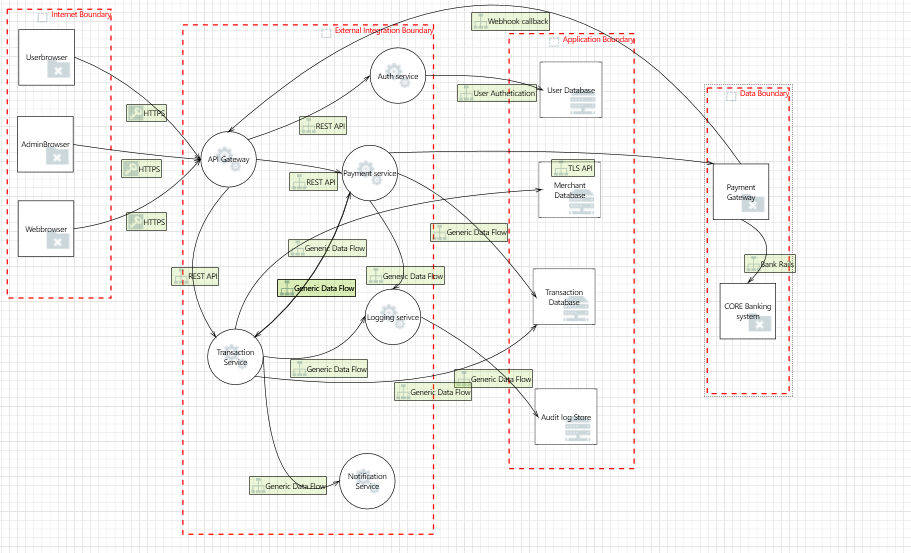
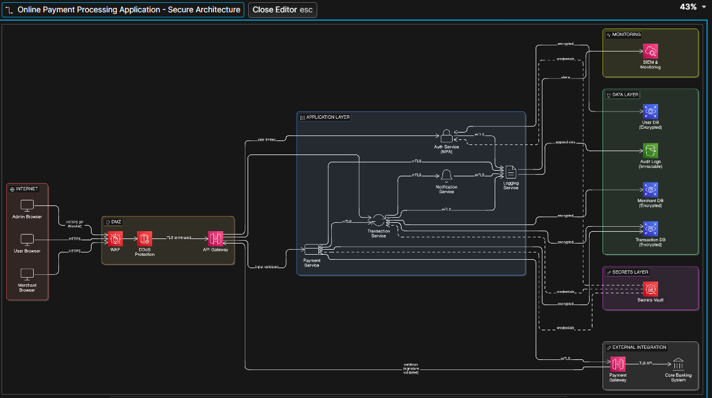

# Secure Architecture & Threat Model  
## Online Payment Processing Application

---

# Task 1: System Overview

This project models and secures an **Internet-facing Online Payment Processing Application**.

The system enables:
- Users to make online payments
- Merchants to receive payments
- Admins to monitor and manage transactions
- Integration with a third-party payment gateway
- Communication with a core banking system

The system is assumed to be:
- Internet-facing
- Cloud-agnostic
- Targeted by both external and insider threats

---

# 2. System Components

## 2.1 Frontend
- Public web application (users + merchants)
- Admin portal (separate interface)

## 2.2 Backend Services
- REST API backend
- Authentication service
- Payment processing service
- Transaction management service

## 2.3 Data Storage
- User database
- Merchant database
- Transaction database
- Audit log storage

## 2.4 External Integrations
- Payment gateway provider
- Core banking system

---

# 3. Actors

| Actor | Description |
|-------|-------------|
| User | Makes payments |
| Merchant | Receives payments |
| Admin | Monitors and manages system |
| Attacker (External) | Internet-based threat actor |
| Insider | Malicious employee |
| Payment Gateway | External financial processor |
| Bank System | Core banking infrastructure |

---

# 4. Assets

## High-Value Assets
- Payment card data
- Transaction records
- User credentials
- Merchant account data
- Banking integration secrets
- API keys
- System configuration

## Security Properties (CIA)

| Asset | Confidentiality | Integrity | Availability |
|--------|----------------|-----------|--------------|
| Card Data | Critical | Critical | Medium |
| Transactions | High | Critical | High |
| Credentials | Critical | High | High |
| Logs | Medium | High | Medium |

---

# 5. Data Types Handled

- Personally Identifiable Information (PII)
- Payment card data
- Transaction amounts
- Authentication credentials
- Audit logs
- API tokens

---
## High-Level Architecture Diagram

---
# 7. Trust Boundaries

1. Internet Boundary (User → Frontend)
2. Frontend → Backend boundary
3. Backend → Database boundary
4. Backend → Payment Gateway boundary
5. Admin access boundary
6. Internal service-to-service boundary

Each boundary represents a change in trust level and must be secured.

---

# Task 2: Asset Identification and Security Objectives

## 1. Asset Identification

## 1.1 Asset Inventory Table

| Asset ID | Asset Name | Description | Asset Type | Sensitivity Level |
|-----------|------------|-------------|------------|-------------------|
| A1 | User Credentials | Passwords, MFA secrets, tokens | Authentication Data | Critical |
| A2 | Payment Card Data | Card number, CVV, expiry | Financial Data | Critical |
| A3 | Transaction Records | Payment amounts, timestamps, merchant ID | Financial Data | High |
| A4 | Personal Data | Name, email, phone number | PII | High |
| A5 | Merchant Account Data | Bank account details, payout info | Financial Data | Critical |
| A6 | API Keys & Secrets | Gateway credentials, service tokens | Secrets | Critical |
| A7 | Business Logic | Payment validation, transaction workflows | Intellectual Property | High |
| A8 | Audit Logs | Admin actions, transaction logs | Security Evidence | High |
| A9 | System Availability | Uptime of services and APIs | Operational Asset | Critical |

---

## 2. Security Objectives

The system must ensure the following security properties:

### Confidentiality
Sensitive information must not be disclosed to unauthorized parties.

### Integrity
Data must not be altered without authorization.

### Availability
System services must remain operational and accessible.

### Accountability
Actions must be traceable to a specific identity.

---

## 3. Mapping Assets to Security Objectives

| Asset | Confidentiality | Integrity | Availability | Accountability |
|--------|----------------|-----------|--------------|----------------|
| User Credentials | Critical | High | High | High |
| Payment Card Data | Critical | Critical | Medium | High |
| Transaction Records | High | Critical | High | High |
| Personal Data | High | High | Medium | Medium |
| Merchant Account Data | Critical | Critical | High | High |
| API Keys & Secrets | Critical | High | High | High |
| Business Logic | Medium | Critical | High | Medium |
| Audit Logs | Medium | Critical | High | Critical |
| System Availability | Low | Medium | Critical | Medium |

---

# Task 3: Threat Modelling

## ThreatModelling Diagram

# Threat Model Table (STRIDE-Based)

| Threat ID | Threat Title | STRIDE Category | Threat Area | Affected Component | Impact | Risk Level |
|-----------|--------------|----------------|-------------|-------------------|--------|------------|
| 0 | Spoofing the UserBrowser External Entity | Spoofing | Authentication | UserBrowser | Unauthorized access through impersonation | High |
| 8 | Spoofing the AdminBrowser External Entity | Spoofing | Administrative Access | AdminBrowser | Full administrative compromise | High |
| 27 | Spoofing the Auth Service Process | Spoofing | Authentication | Auth Service | Credential theft or token manipulation | High |
| 58 | Spoofing the Transaction Service Process | Spoofing | Authorization | Transaction Service | Manipulated financial transactions | High |
| 69 | Spoofing the Payment Service Process | Spoofing | Authorization | Payment Service | Fraudulent payment processing | High |
| 44 | Spoofing the Payment Gateway | Spoofing | API Communication | Payment Gateway | Fraudulent payment confirmation | High |
| 2 | API Gateway Process Crash | Denial of Service | API Communication | API Gateway | Payment processing outage | High |
| 3 | HTTPS Data Flow Interruption | Denial of Service | API Communication | HTTPS Data Flow | Service downtime and transaction interruption | High |
| 40 | Excessive Resource Consumption | Denial of Service | Logging and Monitoring | Logging Service | Loss of monitoring visibility | High |
| 38 | Audit Log Store Write Denial | Repudiation | Logging and Monitoring | Audit Log Store | Loss of accountability and traceability | High |
| 1 | Data Repudiation by API Gateway | Repudiation | API Communication | API Gateway | Transaction disputes and non-repudiation failure | High |
| 81 | Data Flow Sniffing | Information Disclosure | API Communication | Data Flow | Exposure of credentials or payment data | High |
| 85 | Elevation Using Impersonation | Elevation of Privilege | Authorization | API Gateway | Unauthorized privilege escalation | High |
| 56 | Execution Flow Manipulation | Elevation of Privilege | Authorization | API Gateway | Bypass of security controls | High |
| 36 | Spoofing Audit Log Store | Spoofing | Logging and Monitoring | Audit Log Store | Tampered audit records | High |
| 24 | Elevation via Auth Service Impersonation | Elevation of Privilege | Authentication | Auth Service | Authentication bypass | High |

# Task 4: Secure architechture design

This section proposes architectural security controls for the Online Payment Processing Application.  
The controls address previously identified STRIDE threats and are aligned with the required control categories.

---

# 1. Identity and Access Management (IAM)

## Control 1: Centralized Authentication with MFA
All user and admin authentication must pass through the Auth Service with Multi-Factor Authentication (MFA) for administrative accounts.

**Justification:**  
Mitigates spoofing and credential theft threats. Reduces risk of admin account compromise.

---

## Control 2: Role-Based Access Control (RBAC)
Enforce strict RBAC policies for:
- Users
- Merchants
- Admins

Admin roles must be isolated from user roles.

**Justification:**  
Prevents elevation of privilege and unauthorized data access.

---

## Control 3: Token-Based Authentication (Short-Lived JWTs)
Use signed, short-lived access tokens with refresh tokens.

**Justification:**  
Reduces replay attack and token misuse risk.

---

# 2. Network Segmentation

## Control 4: Trust Boundary Enforcement
Enforce strict separation between:
- Internet Boundary
- Application Boundary
- Data Boundary
- External Integration Boundary

Databases must never be directly accessible from the Internet.

**Justification:**  
Reduces lateral movement and limits attack surface.

---

## Control 5: API Gateway as Single Entry Point
All external traffic must pass through the API Gateway.

No direct service exposure.

**Justification:**  
Prevents bypass of authentication and rate limiting controls.

---

## Control 6: Separate Admin Plane
Admin traffic must use:
- Separate endpoint
- Separate access policies
- Restricted network access (IP allowlisting)

**Justification:**  
Mitigates administrative access threats.

---

# 3. Data Protection

## Control 7: Encryption in Transit
All communications must use TLS 1.2+ including:
- Browser to API Gateway
- Service-to-service communication
- Payment Gateway integration

**Justification:**  
Mitigates data sniffing and interception threats.

---

## Control 8: Encryption at Rest
All databases must use strong encryption (AES-256).

**Justification:**  
Protects against data breach and unauthorized database access.

---

## Control 9: Payment Data Tokenization
Payment card data must not be stored directly.  
Use tokenization via Payment Gateway.

**Justification:**  
Reduces regulatory exposure and impact of database compromise.

---

# 4. Secrets Management

## Control 10: Centralized Secrets Vault
API keys, database credentials, and gateway tokens must be stored in a secure secrets management system.

No hardcoded secrets.

**Justification:**  
Mitigates API key leakage and impersonation threats.

---

## Control 11: Key Rotation Policy
Enforce automatic rotation of:
- API keys
- Database credentials
- Service tokens

**Justification:**  
Limits long-term impact of compromised credentials.

---

# 5. Monitoring and Logging

## Control 12: Immutable Audit Logging
Audit logs must be append-only and tamper-resistant.

**Justification:**  
Prevents repudiation and log tampering.

---

## Control 13: Centralized Monitoring and Alerting
Deploy monitoring for:
- Failed authentication attempts
- Suspicious transaction patterns
- Resource exhaustion
- Unusual admin activity

**Justification:**  
Early detection of denial-of-service and privilege escalation attacks.

---

## Control 14: Log Retention and Integrity Verification
Store logs securely with integrity verification (hash validation).

**Justification:**  
Ensures accountability and forensic reliability.

---

# 6. Secure Deployment Practices

## Control 15: Infrastructure as Code with Security Baselines
Deploy infrastructure using predefined hardened configurations.

**Justification:**  
Reduces configuration drift and misconfiguration risks.

---

## Control 16: Environment Separation
Separate environments:
- Development
- Testing
- Production

Production data must not be used in lower environments.

**Justification:**  
Prevents data leakage and unauthorized access.

---

## Control 17: Defense-in-Depth Strategy
Implement layered security:
- WAF in front of API Gateway
- Rate limiting
- Intrusion detection
- Network firewalls

**Justification:**  
Provides multiple layers of protection against denial-of-service and spoofing attacks.

---

# Updated Architecture Summary

The updated secure architecture now includes:

- API Gateway as controlled entry point
- MFA for administrative access
- Segmented network boundaries
- Encrypted communication and storage
- Centralized secrets management
- Immutable audit logging
- Monitoring and alerting mechanisms
- Defense-in-depth controls

These architectural controls directly address previously identified STRIDE threats and reduce overall system risk.

## Secure Architecture Diagram

# Task 5: Risk Treatment and Residual Risk

All identified threats were initially classified as High risk due to the system handling sensitive financial and personal data.

This section defines how each high-risk threat is treated and explains any residual risk.

---

# Risk Treatment Strategy

Risk handling methods used:

- Mitigate — Implement architectural security controls
- Transfer — Shift responsibility to trusted third party
- Accept — Risk remains within acceptable threshold
- Avoid — Remove functionality to eliminate risk

---

# Risk Treatment Table

| Threat                                   | STRIDE Category        | Initial Risk | Treatment Strategy        | Treatment Action Implemented                                  | Residual Risk |
|-------------------------------------------|------------------------|--------------|---------------------------|----------------------------------------------------------------|---------------|
| Spoofing User Browser                    | Spoofing               | High         | Mitigate                  | MFA, TLS enforcement, token validation                         | Medium        |
| Spoofing Admin Browser                   | Spoofing               | High         | Mitigate                  | MFA, IP allowlisting, strict RBAC                              | Low           |
| Spoofing Auth Service                    | Spoofing               | High         | Mitigate                  | Mutual TLS, signed tokens                                      | Medium        |
| Spoofing Payment Gateway                 | Spoofing               | High         | Mitigate + Transfer       | Webhook signature validation, contractual SLA with provider    | Medium        |
| API Gateway Crash (DoS)                  | Denial of Service      | High         | Mitigate                  | WAF, rate limiting, autoscaling                                | Medium        |
| HTTPS Data Interruption                  | Denial of Service      | High         | Mitigate                  | Redundant infrastructure, TLS hardening                        | Medium        |
| Logging Service Resource Exhaustion      | Denial of Service      | High         | Mitigate                  | Log throttling, monitoring alerts                              | Medium        |
| Audit Log Write Denial                   | Repudiation            | High         | Mitigate                  | Append-only immutable logging                                  | Low           |
| Data Flow Sniffing                       | Information Disclosure | High         | Mitigate                  | End-to-end TLS encryption                                      | Low           |
| Privilege Escalation via API Gateway     | Elevation of Privilege | High         | Mitigate                  | Least privilege RBAC enforcement                               | Medium        |
| Execution Flow Manipulation              | Elevation of Privilege | High         | Mitigate                  | Strict input validation, service authentication                | Medium        |
# Transfer Decisions

Certain risks are partially transferred:

- Payment fraud risk transferred to Payment Gateway provider via contractual SLAs.
- Infrastructure-level DDoS risks partially transferred to cloud/network provider.

---

# Avoid Decisions

No core business functionality was removed.  
Payment processing is essential and cannot be avoided.

---

# Accept Decisions

Low-impact residual risks such as minor service interruption within SLA thresholds are accepted due to cost-benefit trade-offs.

---

# Residual Risk Explanation

Even after mitigation:

- Spoofing risk remains due to potential credential phishing.
- Denial of Service risk remains due to unpredictable large-scale attacks.
- Insider misuse risk remains despite RBAC and monitoring.
- Zero-day vulnerabilities cannot be fully eliminated.

Residual risk is reduced from High to Medium or Low through layered architectural controls.

The system adopts a defense-in-depth strategy to ensure that no single control failure results in total compromise.

---

# Final Risk Posture

Initial Risk Level: High (financial system, internet-facing)  
Post-Treatment Risk Level: Medium  

The remaining risk is considered acceptable within operational and regulatory tolerance thresholds.

# Assumptions and Limitations

This project is based on a conceptual online payment processing system and includes the following assumptions and limitations.

---

# Assumptions

## 1. Trusted Cloud Infrastructure
It is assumed that the underlying cloud infrastructure (network hardware, virtualization layer, and physical security) is secure and managed by a trusted provider.

## 2. Secure Third-Party Payment Gateway
The external Payment Gateway and Core Banking System are assumed to:
- Enforce strong security controls
- Maintain PCI-DSS compliance
- Implement proper encryption and fraud detection

## 3. Correct Implementation of Controls
It is assumed that:
- MFA is properly configured
- TLS certificates are valid and correctly deployed
- RBAC policies are correctly enforced
- Secrets management is securely implemented

## 4. No Malicious Insiders in Infrastructure Teams
The model assumes no intentional insider sabotage at infrastructure or database administration level.

## 5. STRIDE-Based Threat Coverage
The threat model assumes that the STRIDE framework adequately captures the majority of relevant security risks for this system.

## 6. Internet-Facing System
The architecture assumes the system is publicly accessible via the internet and must handle hostile external traffic.

---

# Limitations

## 1. Conceptual Architecture Only
This threat model is based on a high-level architecture diagram.  
It does not include:
- Source code review
- Configuration review
- Deployment pipeline validation
- Infrastructure-specific misconfiguration analysis

## 2. No Quantitative Risk Scoring
Risk levels were assigned qualitatively (High/Medium/Low).  
No formal quantitative risk model (e.g., FAIR, CVSS scoring) was applied.

## 3. Zero-Day Vulnerabilities Not Modeled
The analysis does not account for unknown zero-day vulnerabilities in:
- Third-party libraries
- Operating systems
- Cloud services

## 4. Limited Insider Threat Modeling
While administrative access risks were considered, deep insider threat scenarios were not exhaustively modeled.

## 5. No Performance-Security Tradeoff Analysis
The design does not evaluate performance impacts of:
- Encryption overhead
- Logging verbosity
- Rate limiting thresholds

## 6. External Dependencies Outside Control
Security of:
- Payment Gateway
- Core Banking System
- Cloud infrastructure

is outside direct architectural control and therefore introduces unavoidable residual risk.

## 7. Compliance Validation Not Included
Although payment systems require regulatory compliance (e.g., PCI-DSS), formal compliance validation was not performed in this analysis.

---

# Summary

This threat modeling and secure architecture design exercise provides a structured, defense-in-depth approach to reducing risk.  
However, due to its high-level and conceptual nature, it cannot guarantee elimination of all security threats.

Residual risk remains inherent in any internet-facing financial system.

