# DVWA Security Lab Report

## Student: Sheikh Sabahat
## Course: Application Security Testing  
## Environment: DVWA deployed using Docker

---


# Vulnerability Testing

## Vulnerability: Brute Force

The Brute Force vulnerability demonstrates how attackers can attempt multiple password guesses until they successfully authenticate.

DVWA allows testing this vulnerability at three security levels:

- Low
- Medium
- High

---

# Brute Force — Security Level: LOW

## Payload Used

```
password
```

Username used:

```
admin
```

Example login request:

```
http://localhost:8080/vulnerabilities/brute/?username=admin&password=password&Login=Login
```

---

## Result

The login was successful when the correct password was entered.

There were no restrictions on the number of login attempts, meaning multiple password guesses could be tried repeatedly.

---

## Screenshot


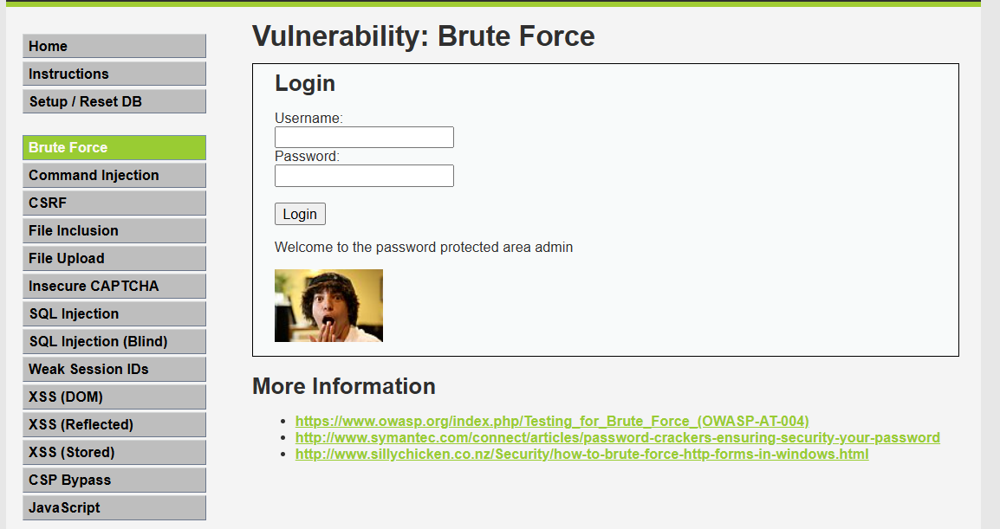


## Explanation (Why the Attack Works)

At the **Low security level**, DVWA does not implement any protection mechanisms against brute force attacks.

User input is directly processed without restrictions such as:

- account lockouts
- login attempt limits
- CAPTCHA verification
- request delays

Because of this, attackers can continuously try different password combinations until the correct credentials are discovered.

# Brute Force — Security Level: MEDIUM

## Payload Used

```
password
```

Username used:

```
admin
```

---

## Result

The login still succeeds when the correct password is entered, but the system introduces a delay between login attempts.

---

## Screenshot

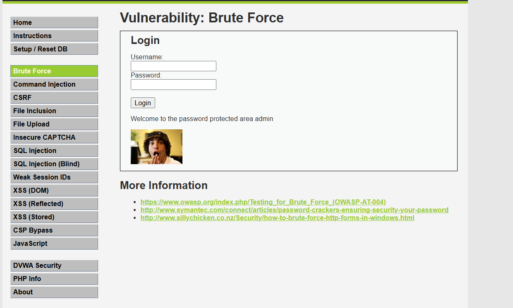

---

## Explanation (Why the Attack Still Works)

At the **Medium security level**, DVWA introduces a small delay after each login attempt.

This delay slows down brute force attacks but does not completely prevent them.

Attackers can still perform brute force attacks using automated tools, although the attack will take longer due to the delay.

The application still lacks critical protections such as:

- rate limiting
- account lockouts
- IP blocking

Therefore, the vulnerability remains exploitable.

---

# Brute Force — Security Level: HIGH

## Payload Used

```
password
```

Username used:

```
admin
```

---

## Result

At the High security level, the brute force attack becomes more difficult due to the implementation of additional protections.

---

## Screenshot

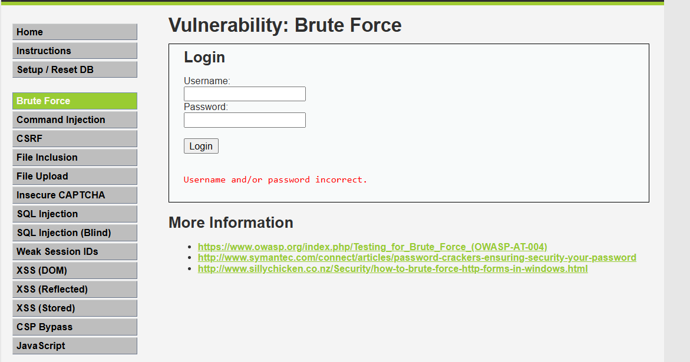


---

## Explanation (Why the Attack Becomes Difficult)

At the **High security level**, DVWA introduces additional protection mechanisms such as **CSRF tokens**.

Each login request requires a unique token that must match the user session.

Example request parameters include:

```
username=admin
password=password
user_token=unique_token_value
Login=Login
```

Because the token changes with each request, automated brute force scripts cannot easily repeat login attempts without retrieving a new token for every request.

This significantly reduces the effectiveness of automated brute force attacks.

---

# Security Level Comparison

| Security Level | Protection Implemented | Attack Success |
|----------------|-----------------------|---------------|
| Low | No protection | Attack succeeds easily |
| Medium | Delay between login attempts | Attack succeeds but slower |
| High | CSRF token protection | Attack becomes difficult |

---

# OWASP Top 10 Mapping

The brute force vulnerability relates to the following OWASP category:

**A07: Identification and Authentication Failures**

This occurs when authentication mechanisms fail to protect against credential guessing attacks.

---

# Command Injection

## Vulnerability Overview

Command Injection occurs when an application passes user-controlled input to a system shell command without proper validation or sanitization. This allows attackers to execute arbitrary commands on the server.

In DVWA, the user is asked to input an IP address to ping a device. The input is passed to a system command that executes the ping operation.

If the input is not properly sanitized, attackers can append additional system commands.

---

# Security Level: LOW

## Payload Used

```
127.0.0.1; ls
```

## Result

The application executed both the ping command and the injected `ls` command. The output displayed the list of files from the server directory.

## Screenshot

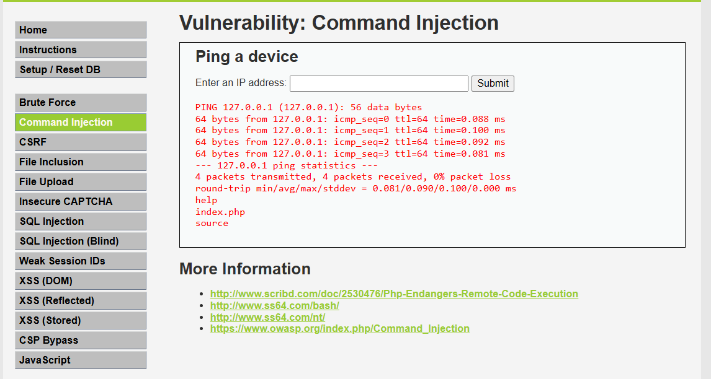

## Explanation (Why it Worked)

At the Low security level, the application does not perform any validation or filtering of user input.

The backend command executed by the server resembles:

```
ping 127.0.0.1; ls
```

Because the semicolon (`;`) is interpreted by the shell as a command separator, the system executes both commands sequentially.

This allows attackers to run arbitrary commands on the server.

---

# Security Level: MEDIUM

## Payload Used

```
127.0.0.1 | ls
```

## Result

The application executed the injected command and displayed the output of the `ls` command.

## Screenshot

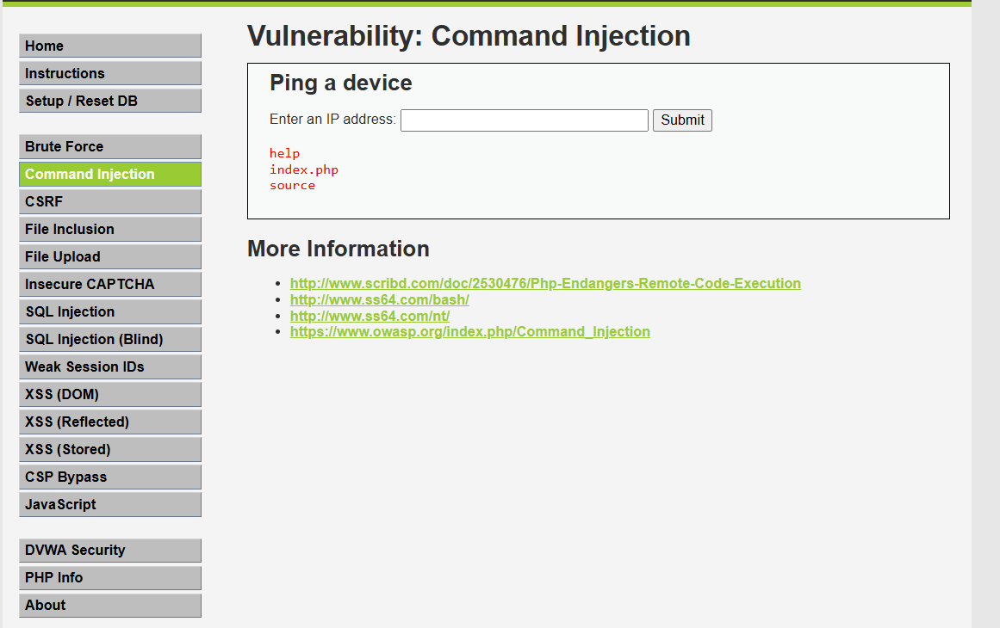

## Explanation (Why it Worked)

At the Medium security level, DVWA attempts to filter certain dangerous characters such as `;` and `&&`.

However, the filter does not block the pipe operator (`|`).

The pipe operator allows the attacker to chain commands, resulting in command injection despite the partial filtering.

This demonstrates how incomplete input filtering can still leave an application vulnerable.

---

# Security Level: HIGH

## Payload Used

```
127.0.0.1 | whoami
```

## Result

The command injection was still successful and returned the username of the process running the web server inside the container.

## Screenshot

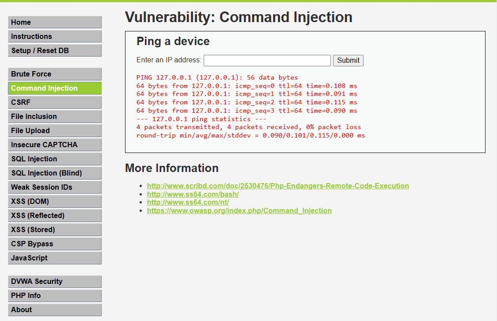

## Explanation (Why it Worked)

Although the High security level introduces stronger filtering mechanisms, the application still allows the pipe (`|`) operator to be processed by the shell.

Because of this, attackers can still inject commands using alternative operators that bypass the implemented filters.

This highlights a common mistake in security implementations where developers attempt to blacklist certain characters instead of using proper input validation or safe command execution methods.

---

# Security Level Comparison

| Security Level | Payload | Result | Reason |
|----------------|--------|--------|-------|
| Low | `127.0.0.1; ls` | Successful | No input filtering |
| Medium | `127.0.0.1 | ls` | Successful | Partial filtering |
| High | `127.0.0.1 | whoami` | Successful | Pipe operator not blocked |

---

# OWASP Top 10 Mapping

This vulnerability falls under:

**OWASP Top 10: A03 – Injection**

Command injection is a type of injection vulnerability where user input is interpreted as part of a system command.

---

# Security Impact

If exploited in a real-world application, attackers could:

- Execute arbitrary system commands
- Read sensitive files from the server
- Escalate privileges
- Completely compromise the server

This makes command injection one of the most critical vulnerabilities in web applications.

---

# Cross Site Request Forgery (CSRF)

## Vulnerability Overview

Cross Site Request Forgery (CSRF) is a vulnerability that allows an attacker to trick an authenticated user into performing unintended actions on a web application.

Because browsers automatically include session cookies with requests, a malicious request can be executed without the user's knowledge if proper protections are not implemented.

In DVWA, this vulnerability allows an attacker to change the administrator password by sending a crafted request.

---

# Security Level: LOW

## Payload Used

```
http://localhost:8080/vulnerabilities/csrf/?password_new=hacked123&password_conf=hacked123&Change=Change
```

## Result

The password was successfully changed when the URL was executed while logged in.

## Screenshot

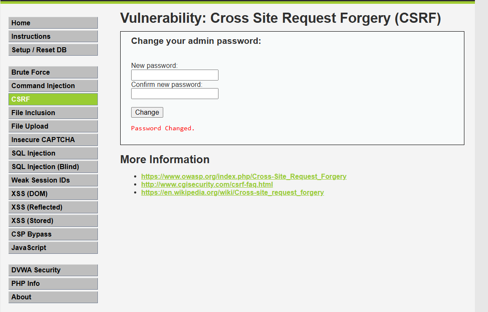

## Explanation (Why the Attack Works)

At the Low security level, the application does not perform any validation to verify whether the request was initiated by the legitimate user.

The password change request is processed directly without checking the request origin or validating a CSRF token.

Because the user's authentication cookie is automatically included in the request, the server treats it as a valid authenticated action.

This allows an attacker to trick the victim into clicking a malicious link that changes their password.

---

# Security Level: MEDIUM

## Payload Used

```
http://localhost:8080/vulnerabilities/csrf/?password_new=medium123&password_conf=medium123&Change=Change
```

## Result

The attack failed and the application displayed the following message:

```
That request didn't look correct.
```

## Screenshot

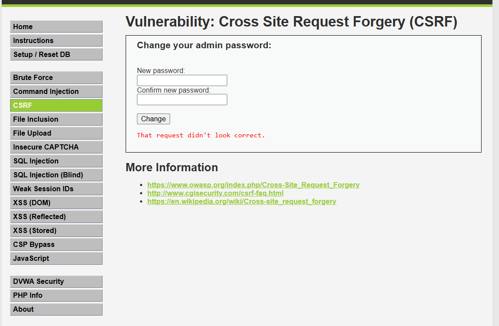

## Explanation

At the Medium security level, DVWA introduces a validation check on the HTTP Referer header.

The application verifies that the request originates from the legitimate DVWA page before allowing the password change.

Since the payload was executed directly through the browser URL, the Referer header was missing or invalid.

As a result, the application rejected the request and prevented the CSRF attack.

Although referer validation provides some protection, it is not considered a fully reliable defense because referer headers can sometimes be manipulated or removed.

---

# Security Level: HIGH

## Payload Used

```
http://localhost:8080/vulnerabilities/csrf/?password_new=high123&password_conf=high123&Change=Change
```

## Result

The attack failed and the application rejected the request.

## Screenshot

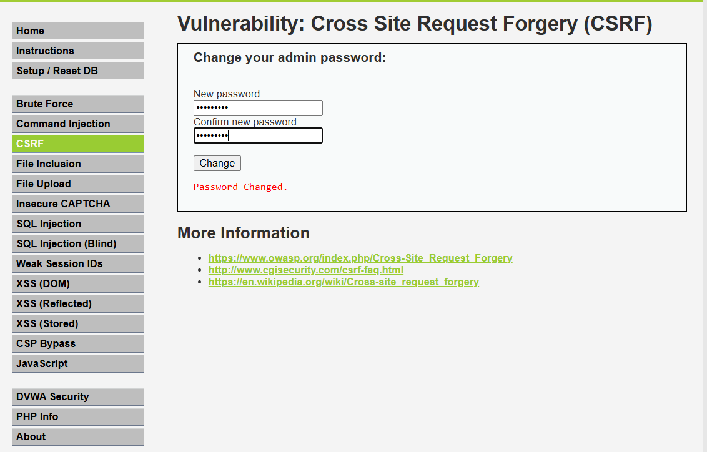

## Explanation

At the High security level, DVWA implements a CSRF token mechanism.

Each request to change the password must include a valid token generated by the application.

The token is tied to the user session and must be submitted with the request.

Because the crafted URL did not include the required CSRF token, the application rejected the request and prevented the attack.

CSRF tokens are considered a strong defense against CSRF attacks when implemented correctly.

---

# Security Level Comparison

| Security Level | Protection Implemented | Result |
|----------------|-----------------------|--------|
| Low | No protection | Attack succeeds |
| Medium | Referer validation | Attack blocked |
| High | CSRF token validation | Attack blocked |

---

# OWASP Top 10 Mapping

This vulnerability relates to:

**OWASP Top 10 – A01: Broken Access Control**

CSRF exploits the trust a web application places in the user's browser and can lead to unauthorized actions being performed on behalf of the victim.

---

# Security Impact

If exploited in real-world applications, CSRF attacks could allow attackers to:

- Change account passwords
- Perform financial transactions
- Modify user account settings
- Take control of user accounts

Implementing CSRF tokens, proper request validation, and secure session management are critical to preventing these attacks.

---

# File Upload

## Vulnerability Overview

Unrestricted file upload vulnerabilities occur when an application allows users to upload files without proper validation or restrictions.

Attackers can upload malicious files such as web shells and execute arbitrary commands on the server. This can lead to complete server compromise.

In DVWA, the file upload functionality is intended to allow image uploads. However, improper validation allows attackers to upload executable PHP files.

---

# Security Level: LOW

## Payload Used

Malicious file:

```
shell.php
```

Contents of the file:

```php
<?php system($_GET['cmd']); ?>
```

## Result

The PHP file was successfully uploaded to the server.

Upload confirmation message:

```
../../../hackable/uploads/shell.php successfully uploaded!
```

The uploaded shell allowed execution of system commands through the browser.

Example command executed:

```
http://localhost:8080/hackable/uploads/shell.php?cmd=whoami
```

Example result:

```
www-data
```

## Screenshot

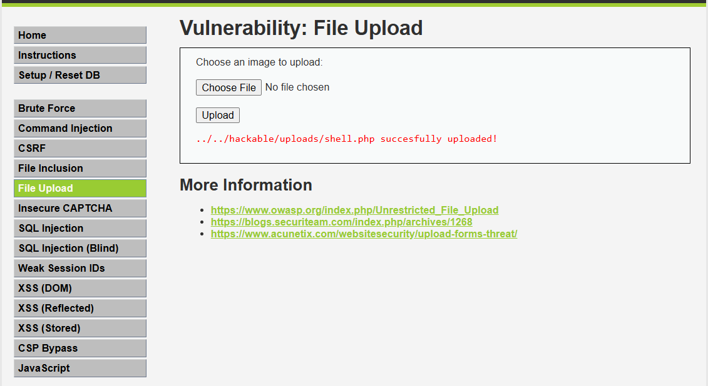

## Explanation (Why the Attack Works)

At the Low security level, the application does not perform any validation on uploaded files.

Because of this, attackers can upload executable PHP files which can then be accessed through the browser.

This allows attackers to run system commands on the server and potentially gain full control of the system.

---

# Security Level: MEDIUM

## Payload Used

```
shell.php.jpg
```

## Result

The file upload bypassed the weak file extension validation.

The application attempted to block `.php` files, but it was still possible to upload a malicious file using a double extension.

## Screenshot

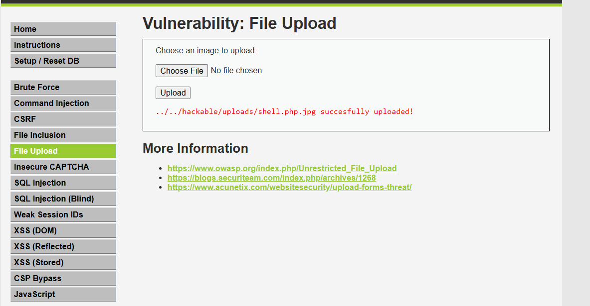

## Explanation

At the Medium security level, DVWA introduces basic validation by checking the file extension.

However, the validation is weak and can be bypassed by renaming the file using a double extension such as `.php.jpg`.

Because the server still interprets the file as PHP in certain cases, attackers may still execute malicious code.

This demonstrates improper file validation.

---

# Security Level: HIGH

## Payload Used

```
shell.php
```

## Result

The upload attempt was blocked by the application.

The system prevented the malicious PHP file from being uploaded.

## Screenshot

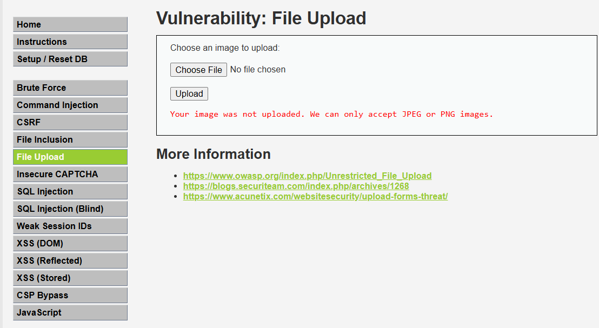

## Explanation

At the High security level, DVWA performs stronger validation on uploaded files.

The application checks both the file extension and the file type to ensure that only legitimate image files are accepted.

This prevents attackers from uploading executable PHP scripts.

---

# Security Level Comparison

| Security Level | Payload | Result |
|----------------|--------|--------|
| Low | `shell.php` | Malicious file uploaded and executed |
| Medium | `shell.php.jpg` | Validation bypassed |
| High | `shell.php` | Upload blocked |

---

# OWASP Top 10 Mapping

This vulnerability relates to:

**OWASP Top 10 – A05: Security Misconfiguration**

Improper file upload validation can allow attackers to upload malicious scripts and gain control of the server.

---

# Security Impact

If exploited in real-world applications, attackers could:

- Upload malicious scripts
- Execute system commands
- Install backdoors
- Access sensitive files
- Take full control of the server

Proper file validation, MIME type checking, and restricting executable uploads are essential security practices to prevent this vulnerability.

---

# SQL Injection

## Vulnerability Overview

SQL Injection is a vulnerability that occurs when an application includes user input directly within SQL queries without proper validation or parameterization. Attackers can manipulate database queries to retrieve unauthorized data, bypass authentication mechanisms, or modify database contents.

In DVWA, the SQL Injection module allows attackers to manipulate the `user_id` parameter to retrieve unintended information from the database.

---

# Security Level: LOW

## Payload Used

```
1' OR '1'='1
```

## Result

The SQL query returned multiple user records from the database instead of a single record. This indicates that the SQL query was successfully manipulated.

Example output included several users such as:

```
ID: 1
First name: admin
Surname: admin

ID: 2
First name: Gordon
Surname: Brown
```

## Screenshot

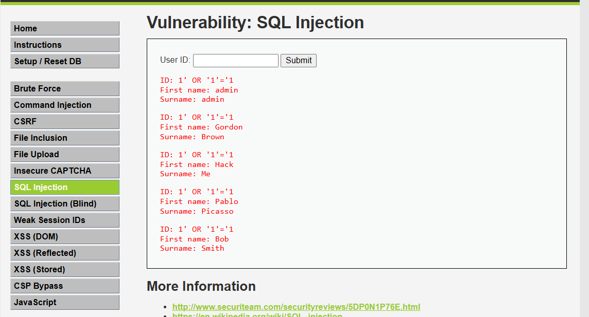

## Explanation (Why the Attack Works)

At the Low security level, the application directly inserts user input into the SQL query without performing any sanitization or validation.

The backend query resembles:

```
SELECT first_name, last_name FROM users WHERE user_id = '$id';
```

The injected payload modifies the logic of the query so that the condition `'1'='1'` always evaluates to true, causing the database to return all records.

---

# Security Level: MEDIUM

## Payload Used

```
1 OR 1=1
```

## Result

The application interface replaced the input field with a dropdown menu containing predefined user IDs (1–5), preventing direct entry of SQL payloads.

## Screenshot

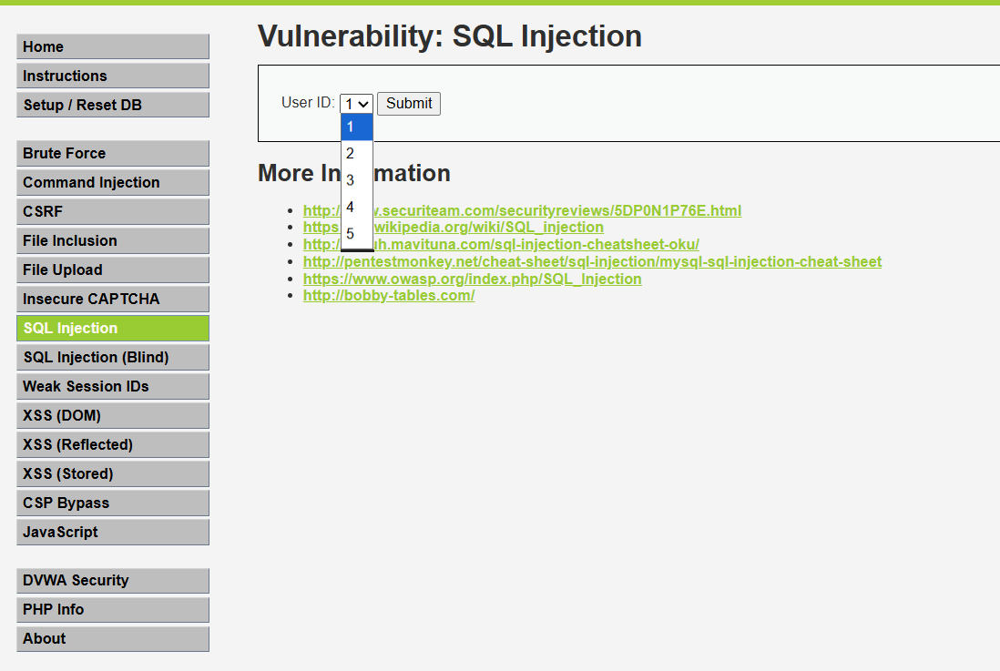

## Explanation

At the Medium security level, DVWA attempts to mitigate SQL injection by restricting user input through a dropdown menu.

This prevents users from directly typing SQL payloads into the input field.

However, this protection only exists on the client side. An attacker could still intercept and modify the HTTP request to inject malicious SQL statements.

For example, modifying the request parameter to:

```
id=1 OR 1=1
```

could still manipulate the SQL query and retrieve unintended database records.

This demonstrates that client-side input restrictions are not sufficient to prevent SQL injection.

---

# Security Level: HIGH

## Payload Used

```
1' OR '1'='1' #
```

## Result

The SQL injection payload was entered through the popup input field and the database returned multiple records.

## Screenshot

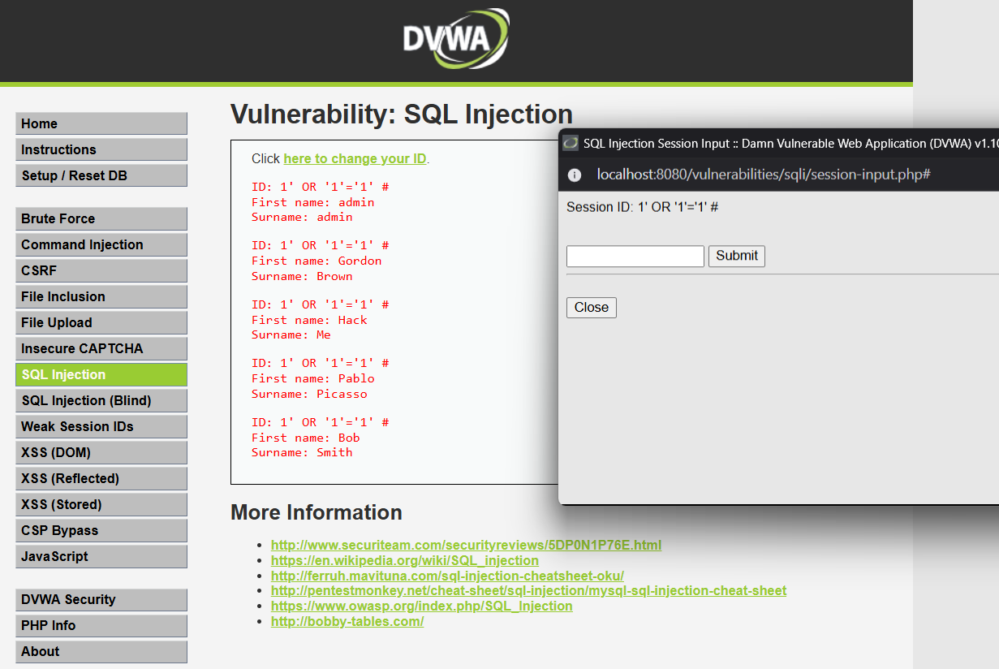

## Explanation

At the High security level, DVWA attempts to sanitize user input using functions such as `mysql_real_escape_string()`.

Although this provides some protection, it is still possible to manipulate the SQL query.

The injected condition `'1'='1'` evaluates to true, which causes the database to return all matching records.

This demonstrates that input sanitization alone is not a reliable defense against SQL injection.

The recommended mitigation is to use parameterized queries or prepared statements.

---

# Security Level Comparison

| Security Level | Payload | Result |
|----------------|--------|--------|
| Low | `1' OR '1'='1` | All user records returned |
| Medium | `1 OR 1=1` | Interface restricts input but vulnerability still exists |
| High | `1' OR '1'='1' #` | Injection still possible |

---

# OWASP Top 10 Mapping

This vulnerability falls under:

**OWASP Top 10 – A03: Injection**

SQL Injection vulnerabilities allow attackers to execute malicious SQL statements that can compromise the database.

---

# Security Impact

If exploited in real-world applications, SQL injection attacks could allow attackers to:

- Retrieve sensitive user data
- Access password hashes
- Modify or delete database records
- Bypass authentication mechanisms
- Completely compromise the database

Using prepared statements and parameterized queries is the recommended defense against SQL injection attacks.

---

# SQL Injection (Blind)

## Vulnerability Overview

Blind SQL Injection occurs when an application is vulnerable to SQL injection but does not directly display database output to the user. Instead of showing query results, the application returns different responses depending on whether the injected SQL condition evaluates to true or false.

Attackers can exploit this behavior to infer database information such as table names, database names, and user credentials.

In DVWA, the Blind SQL Injection module demonstrates how attackers can extract information by observing application responses or response delays.

---

# Security Level: LOW

## Payload Used

```
1' AND 1=1 #
```

True condition test:

```
1' AND 1=1 #
```

False condition test:

```
1' AND 1=2 #
```

## Result

The application returned different responses depending on whether the SQL condition was true or false.

When the condition was true, the application indicated that the user ID exists in the database.

When the condition was false, the application indicated that the user ID was missing.

This confirmed that SQL injection was possible.

## Screenshot

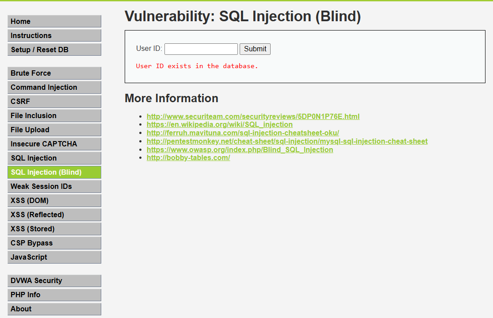

## Explanation (Why the Attack Works)

At the Low security level, the application directly includes user input in the SQL query without performing validation or sanitization.

Because the response changes depending on the injected condition, attackers can determine whether the SQL query evaluates to true or false.

This allows attackers to extract information from the database using blind SQL injection techniques.

---

# Security Level: MEDIUM

## Payload Used

No payload could be directly entered due to interface restrictions.

## Result

The application replaced the input field with a dropdown menu containing predefined user IDs.

Because users cannot manually enter SQL payloads through the interface, direct SQL injection from the browser input field was not possible.

## Screenshot

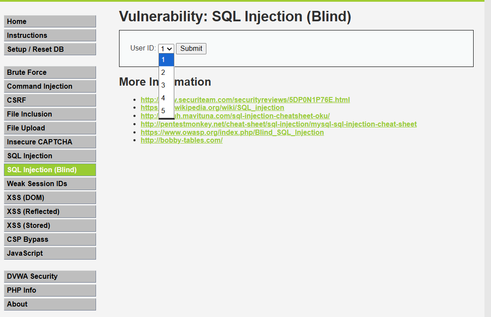

## Explanation

At the Medium security level, DVWA attempts to mitigate SQL injection by restricting input through a dropdown menu.

This prevents users from directly entering SQL injection payloads through the interface.

However, this protection only exists on the client side. An attacker could still modify the HTTP request or intercept the request using tools such as Burp Suite to inject malicious SQL statements.

Therefore, the vulnerability may still exist if the request is manipulated outside the user interface.

---

# Security Level: HIGH

## Payload Used

```
1' AND SLEEP(5) #
```

## Result

The page response was delayed by approximately 5 seconds after submitting the payload.

This delay confirmed that the SQL query was executed with the injected condition.

## Screenshot

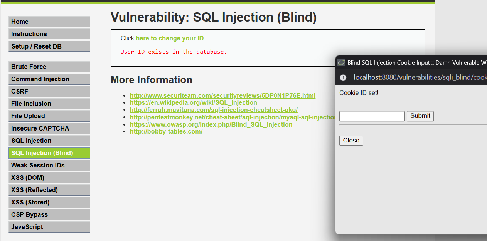

## Explanation

At the High security level, DVWA moves the injection point to a cookie parameter instead of a standard input field.

Although this change attempts to improve security, the application still constructs SQL queries using unsanitized cookie data.

By using a time-based payload such as `SLEEP(5)`, attackers can determine whether the injected SQL condition is executed based on the delay in the server response.

This demonstrates that blind SQL injection is still possible.

---

# Security Level Comparison

| Security Level | Payload | Result |
|----------------|--------|--------|
| Low | `1' AND 1=1 #` | Blind SQL injection successful |
| Medium | Input restricted to dropdown | Direct injection prevented in UI |
| High | `1' AND SLEEP(5) #` | Time-based blind injection successful |

---

# OWASP Top 10 Mapping

This vulnerability relates to:

**OWASP Top 10 – A03: Injection**

Blind SQL injection allows attackers to extract database information even when the application does not display query results.

---

# Security Impact

If exploited in real-world systems, attackers could:

- Extract database names and tables
- Retrieve sensitive user data
- Access password hashes
- Perform database enumeration

Using prepared statements and parameterized queries is the recommended defense against SQL injection attacks.


---

# Weak Session IDs

## Vulnerability Overview

Weak Session IDs occur when a web application generates session identifiers that are predictable or follow a recognizable pattern. If an attacker can predict valid session IDs, they may hijack active user sessions without needing authentication credentials.

Session identifiers should be generated using strong random values. Predictable session IDs allow attackers to impersonate legitimate users and gain unauthorized access to the application.

In DVWA, the Weak Session IDs module demonstrates how insecure session generation mechanisms can allow attackers to predict or guess session identifiers.

---

# Security Level: LOW

## Payload Used

This vulnerability does not require a payload. The attack involves analyzing session cookies generated by the application.

## Steps to Perform the Attack

1. Log in to DVWA.
2. Navigate to the **Weak Session IDs** module.
3. Open browser developer tools (F12).
4. Go to **Application → Storage → Cookies → DVWA site**.
5. Locate the cookie named **dvwaSession**.
6. Click the **Generate** button multiple times.
7. Observe the cookie value changing.

## Result

The session ID increases sequentially every time the button is pressed.

Example observed values:

```
1
2
3
4
```

## Screenshot Reference

WeakSessionLow.png

## Explanation

At Low security level, DVWA generates session IDs using a simple incrementing counter. Because the values follow a predictable sequence, attackers can easily guess valid session IDs and hijack active sessions.

---

# Security Level: MEDIUM

## Payload Used

No payload required. The attack involves observing session cookie values.

## Steps to Perform the Attack

1. Set DVWA security level to **Medium**.
2. Navigate to **Weak Session IDs**.
3. Open developer tools.
4. View the **dvwaSession** cookie.
5. Click **Generate** multiple times and observe the values.

## Result

Session IDs appear as large numeric values.

Example observed values:

```
1773125950
1773125964
```

## Screenshot Reference

WeakSessionMedium.png

## Explanation

At Medium security level, DVWA generates session IDs using **Unix timestamps**. A Unix timestamp represents the number of seconds since January 1, 1970.

Although timestamps are less obvious than sequential numbers, they are still predictable because attackers can estimate when a session was created.

---

# Security Level: HIGH

## Payload Used

No payload required. The attack involves observing the generated session cookie.

## Steps to Perform the Attack

1. Set DVWA security level to **High**.
2. Navigate to **Weak Session IDs**.
3. Open developer tools.
4. View the **dvwaSession** cookie.
5. Click **Generate** multiple times.

## Result

Session IDs appear as timestamp-based numeric values.

Example observed value:

```
1773125964
```

## Screenshot Reference

WeakSessionHigh.png

## Explanation

In this DVWA instance, the High security level still generates session IDs derived from timestamp values. While slightly harder to predict than sequential numbers, timestamp-based identifiers remain vulnerable to session prediction attacks if attackers can estimate the approximate session creation time.

---

# Security Level Comparison

| Security Level | Session ID Pattern | Predictability | Security Strength |
|---|---|---|---|
| Low | Sequential integers | Very High | Very Weak |
| Medium | Unix timestamp | High | Weak |
| High | Timestamp-based values | High | Weak |

---

# OWASP Top 10 Mapping

OWASP Top 10 (2021)

A07: Identification and Authentication Failures

Weak session identifiers allow attackers to impersonate legitimate users by predicting valid session tokens.

---

# Security Impact Analysis

Weak session ID generation can lead to multiple security risks including:

- Session hijacking
- Unauthorized account access
- Privilege escalation
- Data exposure
- User impersonation

If attackers can predict session identifiers, they may gain access to active sessions without needing authentication credentials.

---

# Recommended Mitigation

Secure applications should generate session identifiers using **cryptographically secure random values**.

Recommended security practices include:

- Using Cryptographically Secure Random Number Generators (CSPRNG)
- Generating long, random session tokens
- Regenerating session IDs after authentication
- Implementing session expiration
- Invalidating sessions after logout

Strong session identifiers should be unpredictable and resistant to guessing attacks.

---

# DOM Based Cross-Site Scripting (XSS)

## Vulnerability Overview

DOM-based Cross-Site Scripting (XSS) occurs when client-side JavaScript processes untrusted input and inserts it directly into the Document Object Model (DOM) without proper sanitization.

Unlike reflected or stored XSS, the malicious payload is never sent to the server. Instead, the attack executes entirely in the user's browser when JavaScript reads values from the URL and writes them into the page.

In DVWA, the DOM XSS vulnerability occurs because the application reads the `default` parameter or URL fragment and inserts it into the page without sanitizing the input.

---

# Security Level: Low

### Payload Used

http://localhost:8080/vulnerabilities/xss_d/?default=<script>alert('XSS')</script>

### Steps to Perform the Attack

1. Navigate to **XSS (DOM)** in DVWA.
2. Set **DVWA Security Level → Low**.
3. Locate the URL containing the `default` parameter.
4. Replace the value with the malicious payload.
5. Reload the page.

### Result

A JavaScript alert popup appears displaying **XSS**, confirming successful script execution.

### Screenshot

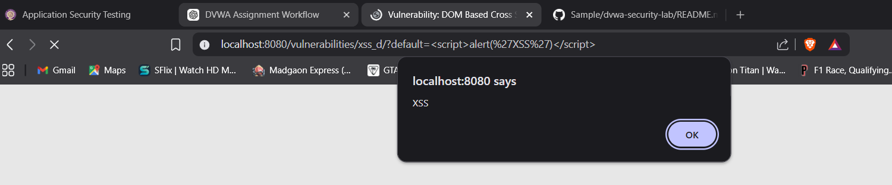

### Explanation

At Low security level, DVWA performs no validation or filtering. The application directly inserts the `default` parameter value into the DOM, allowing arbitrary JavaScript execution.

---

# Security Level: Medium

### Payload Used

http://localhost:8080/vulnerabilities/xss_d/?default=

### Steps to Perform the Attack

1. Change **DVWA Security Level → Medium**.
2. Navigate back to **XSS (DOM)**.
3. Replace the `default` parameter with the payload above.
4. Reload the page.

### Result

A JavaScript alert popup appears again.

### Screenshot

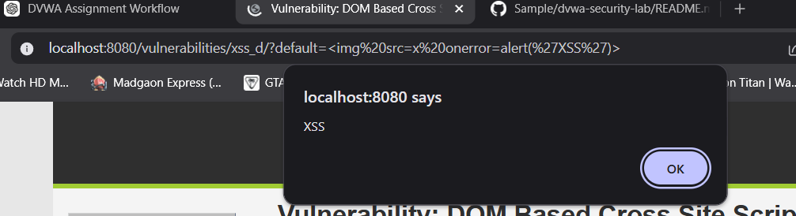

### Explanation

At Medium security level, DVWA attempts to block `<script>` tags but does not properly sanitize other HTML elements. By using an image element with an `onerror` event handler, attackers can still execute JavaScript.

---

# Security Level: High

### Payload Used

http://localhost:8080/vulnerabilities/xss_d/?default=English#<script>alert(1)</script>

### Steps to Perform the Attack

1. Change **DVWA Security Level → High**.
2. Navigate to **XSS (DOM)**.
3. Leave the `default` parameter unchanged.
4. Inject the payload in the URL fragment after the `#`.
5. Reload the page.

### Result

A JavaScript alert popup appears displaying **1**, confirming the script executed successfully.

### Screenshot

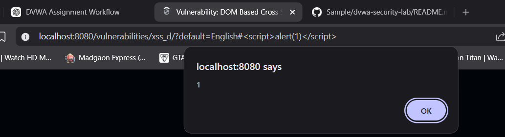

### Explanation

At High security level, DVWA filters the `default` parameter more strictly. However, the application still processes the URL fragment (`#`) using client-side JavaScript. Since the fragment is not sanitized before being written to the DOM, attackers can inject malicious scripts through this portion of the URL.

---

# Security Level Comparison

| Security Level | Filtering Mechanism | Payload Used | Result |
|----------------|--------------------|-------------|--------|
| Low | No filtering | `<script>alert('XSS')</script>` | Successful |
| Medium | Script filtering | `` | Successful |
| High | Parameter filtering but fragment not sanitized | `#<script>alert(1)</script>` | Successful |

---

# OWASP Top 10 Mapping

This vulnerability maps to:

**OWASP Top 10 2021 — A03: Injection**

Cross-Site Scripting (XSS) is categorized under injection vulnerabilities because untrusted input is interpreted as executable code.

---

# Security Impact Analysis

DOM-based XSS vulnerabilities can allow attackers to execute malicious scripts in the victim's browser, which may lead to:

• Session hijacking  
• Cookie theft  
• Account takeover  
• Phishing attacks  
• Redirection to malicious websites  
• Web page defacement  
• Malware delivery  

Because the attack executes on the client side, traditional server-side protections may not detect it.

---

# Mitigation Strategies

To prevent DOM-based XSS vulnerabilities:

• Validate and sanitize all user inputs  
• Avoid inserting untrusted data directly into the DOM  
• Use safe DOM APIs such as `textContent` instead of `innerHTML`  
• Implement Content Security Policy (CSP)  
• Encode user-controlled input before displaying it  
• Avoid unsafe functions such as `document.write()`

---

# Conclusion

The DVWA DOM XSS module demonstrates how insecure client-side handling of user input can lead to DOM-based XSS vulnerabilities. Even when server-side filtering is implemented, improper handling of URL fragments and DOM manipulation can still allow attackers to execute malicious scripts in a user's browser.
