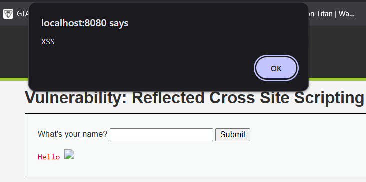
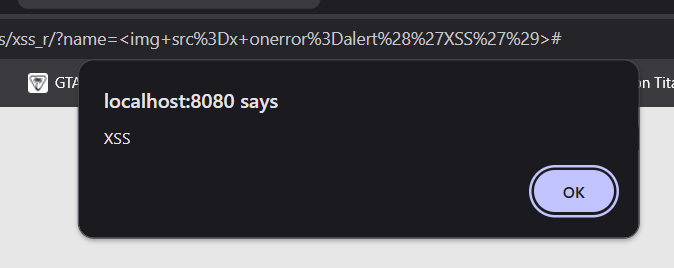
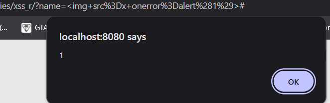
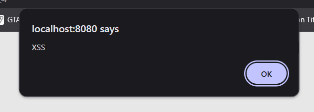
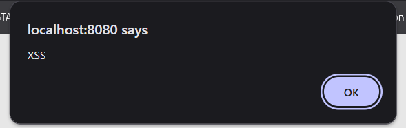
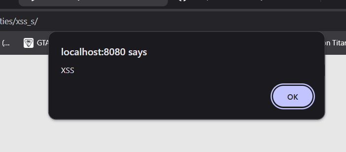
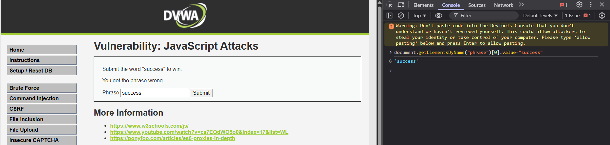
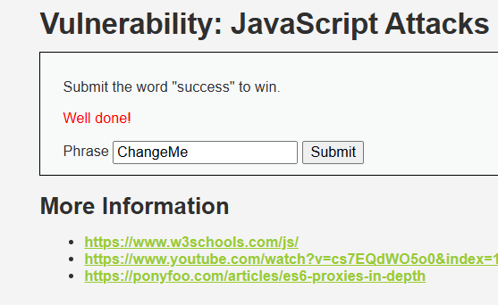
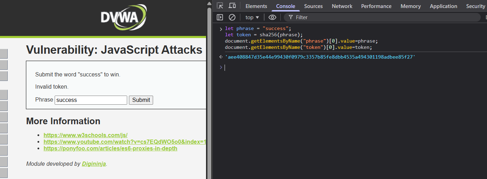
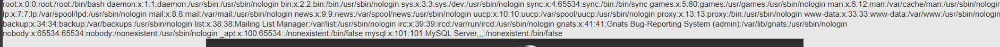

# DVWA Security Lab Report

## Student: Sheikh Sabahat
## Course: Application Security Testing  
## Environment: DVWA deployed using Docker

---


# Vulnerability Testing

## Vulnerability: Brute Force

The Brute Force vulnerability demonstrates how attackers can attempt multiple password guesses until they successfully authenticate.

DVWA allows testing this vulnerability at three security levels:

- Low
- Medium
- High

---

# Brute Force — Security Level: LOW

## Payload Used

```
password
```

Username used:

```
admin
```

Example login request:

```
http://localhost:8080/vulnerabilities/brute/?username=admin&password=password&Login=Login
```

---

## Result

The login was successful when the correct password was entered.

There were no restrictions on the number of login attempts, meaning multiple password guesses could be tried repeatedly.

---

## Screenshot


## Explanation (Why the Attack Works)

At the **Low security level**, DVWA does not implement any protection mechanisms against brute force attacks.

User input is directly processed without restrictions such as:

- account lockouts
- login attempt limits
- CAPTCHA verification
- request delays

Because of this, attackers can continuously try different password combinations until the correct credentials are discovered.

# Brute Force — Security Level: MEDIUM

## Payload Used

```
password
```

Username used:

```
admin
```

---

## Result

The login still succeeds when the correct password is entered, but the system introduces a delay between login attempts.

---

## Screenshot


---

## Explanation (Why the Attack Still Works)

At the **Medium security level**, DVWA introduces a small delay after each login attempt.

This delay slows down brute force attacks but does not completely prevent them.

Attackers can still perform brute force attacks using automated tools, although the attack will take longer due to the delay.

The application still lacks critical protections such as:

- rate limiting
- account lockouts
- IP blocking

Therefore, the vulnerability remains exploitable.

---

# Brute Force — Security Level: HIGH

## Payload Used

```
password
```

Username used:

```
admin
```

---

## Result

At the High security level, the brute force attack becomes more difficult due to the implementation of additional protections.

---

## Screenshot


---

## Explanation (Why the Attack Becomes Difficult)

At the **High security level**, DVWA introduces additional protection mechanisms such as **CSRF tokens**.

Each login request requires a unique token that must match the user session.

Example request parameters include:

```
username=admin
password=password
user_token=unique_token_value
Login=Login
```

Because the token changes with each request, automated brute force scripts cannot easily repeat login attempts without retrieving a new token for every request.

This significantly reduces the effectiveness of automated brute force attacks.

---

# Security Level Comparison

| Security Level | Protection Implemented | Attack Success |
|----------------|-----------------------|---------------|
| Low | No protection | Attack succeeds easily |
| Medium | Delay between login attempts | Attack succeeds but slower |
| High | CSRF token protection | Attack becomes difficult |

---

# OWASP Top 10 Mapping

The brute force vulnerability relates to the following OWASP category:

**A07: Identification and Authentication Failures**

This occurs when authentication mechanisms fail to protect against credential guessing attacks.

---

# Command Injection

## Vulnerability Overview

Command Injection occurs when an application passes user-controlled input to a system shell command without proper validation or sanitization. This allows attackers to execute arbitrary commands on the server.

In DVWA, the user is asked to input an IP address to ping a device. The input is passed to a system command that executes the ping operation.

If the input is not properly sanitized, attackers can append additional system commands.

---

# Security Level: LOW

## Payload Used

```
127.0.0.1; ls
```

## Result

The application executed both the ping command and the injected `ls` command. The output displayed the list of files from the server directory.

## Screenshot


## Explanation (Why it Worked)

At the Low security level, the application does not perform any validation or filtering of user input.

The backend command executed by the server resembles:

```
ping 127.0.0.1; ls
```

Because the semicolon (`;`) is interpreted by the shell as a command separator, the system executes both commands sequentially.

This allows attackers to run arbitrary commands on the server.

---

# Security Level: MEDIUM

## Payload Used

```
127.0.0.1 | ls
```

## Result

The application executed the injected command and displayed the output of the `ls` command.

## Screenshot


## Explanation (Why it Worked)

At the Medium security level, DVWA attempts to filter certain dangerous characters such as `;` and `&&`.

However, the filter does not block the pipe operator (`|`).

The pipe operator allows the attacker to chain commands, resulting in command injection despite the partial filtering.

This demonstrates how incomplete input filtering can still leave an application vulnerable.

---

# Security Level: HIGH

## Payload Used

```
127.0.0.1 | whoami
```

## Result

The command injection was still successful and returned the username of the process running the web server inside the container.

## Screenshot


## Explanation (Why it Worked)

Although the High security level introduces stronger filtering mechanisms, the application still allows the pipe (`|`) operator to be processed by the shell.

Because of this, attackers can still inject commands using alternative operators that bypass the implemented filters.

This highlights a common mistake in security implementations where developers attempt to blacklist certain characters instead of using proper input validation or safe command execution methods.

---

# Security Level Comparison

| Security Level | Payload | Result | Reason |
|----------------|--------|--------|-------|
| Low | `127.0.0.1; ls` | Successful | No input filtering |
| Medium | `127.0.0.1 | ls` | Successful | Partial filtering |
| High | `127.0.0.1 | whoami` | Successful | Pipe operator not blocked |

---

# OWASP Top 10 Mapping

This vulnerability falls under:

**OWASP Top 10: A03 – Injection**

Command injection is a type of injection vulnerability where user input is interpreted as part of a system command.

---

# Security Impact

If exploited in a real-world application, attackers could:

- Execute arbitrary system commands
- Read sensitive files from the server
- Escalate privileges
- Completely compromise the server

This makes command injection one of the most critical vulnerabilities in web applications.

---

# Cross Site Request Forgery (CSRF)

## Vulnerability Overview

Cross Site Request Forgery (CSRF) is a vulnerability that allows an attacker to trick an authenticated user into performing unintended actions on a web application.

Because browsers automatically include session cookies with requests, a malicious request can be executed without the user's knowledge if proper protections are not implemented.

In DVWA, this vulnerability allows an attacker to change the administrator password by sending a crafted request.

---

# Security Level: LOW

## Payload Used

```
http://localhost:8080/vulnerabilities/csrf/?password_new=hacked123&password_conf=hacked123&Change=Change
```

## Result

The password was successfully changed when the URL was executed while logged in.

## Screenshot


## Explanation (Why the Attack Works)

At the Low security level, the application does not perform any validation to verify whether the request was initiated by the legitimate user.

The password change request is processed directly without checking the request origin or validating a CSRF token.

Because the user's authentication cookie is automatically included in the request, the server treats it as a valid authenticated action.

This allows an attacker to trick the victim into clicking a malicious link that changes their password.

---

# Security Level: MEDIUM

## Payload Used

```
http://localhost:8080/vulnerabilities/csrf/?password_new=medium123&password_conf=medium123&Change=Change
```

## Result

The attack failed and the application displayed the following message:

```
That request didn't look correct.
```

## Screenshot


## Explanation

At the Medium security level, DVWA introduces a validation check on the HTTP Referer header.

The application verifies that the request originates from the legitimate DVWA page before allowing the password change.

Since the payload was executed directly through the browser URL, the Referer header was missing or invalid.

As a result, the application rejected the request and prevented the CSRF attack.

Although referer validation provides some protection, it is not considered a fully reliable defense because referer headers can sometimes be manipulated or removed.

---

# Security Level: HIGH

## Payload Used

```
http://localhost:8080/vulnerabilities/csrf/?password_new=high123&password_conf=high123&Change=Change
```

## Result

The attack failed and the application rejected the request.

## Screenshot


## Explanation

At the High security level, DVWA implements a CSRF token mechanism.

Each request to change the password must include a valid token generated by the application.

The token is tied to the user session and must be submitted with the request.

Because the crafted URL did not include the required CSRF token, the application rejected the request and prevented the attack.

CSRF tokens are considered a strong defense against CSRF attacks when implemented correctly.

---

# Security Level Comparison

| Security Level | Protection Implemented | Result |
|----------------|-----------------------|--------|
| Low | No protection | Attack succeeds |
| Medium | Referer validation | Attack blocked |
| High | CSRF token validation | Attack blocked |

---

# OWASP Top 10 Mapping

This vulnerability relates to:

**OWASP Top 10 – A01: Broken Access Control**

CSRF exploits the trust a web application places in the user's browser and can lead to unauthorized actions being performed on behalf of the victim.

---

# Security Impact

If exploited in real-world applications, CSRF attacks could allow attackers to:

- Change account passwords
- Perform financial transactions
- Modify user account settings
- Take control of user accounts

Implementing CSRF tokens, proper request validation, and secure session management are critical to preventing these attacks.

---

# File Upload

## Vulnerability Overview

Unrestricted file upload vulnerabilities occur when an application allows users to upload files without proper validation or restrictions.

Attackers can upload malicious files such as web shells and execute arbitrary commands on the server. This can lead to complete server compromise.

In DVWA, the file upload functionality is intended to allow image uploads. However, improper validation allows attackers to upload executable PHP files.

---

# Security Level: LOW

## Payload Used

Malicious file:

```
shell.php
```

Contents of the file:

```php
<?php system($_GET['cmd']); ?>
```

## Result

The PHP file was successfully uploaded to the server.

Upload confirmation message:

```
../../../hackable/uploads/shell.php successfully uploaded!
```

The uploaded shell allowed execution of system commands through the browser.

Example command executed:

```
http://localhost:8080/hackable/uploads/shell.php?cmd=whoami
```

Example result:

```
www-data
```

## Screenshot


## Explanation (Why the Attack Works)

At the Low security level, the application does not perform any validation on uploaded files.

Because of this, attackers can upload executable PHP files which can then be accessed through the browser.

This allows attackers to run system commands on the server and potentially gain full control of the system.

---

# Security Level: MEDIUM

## Payload Used

```
shell.php.jpg
```

## Result

The file upload bypassed the weak file extension validation.

The application attempted to block `.php` files, but it was still possible to upload a malicious file using a double extension.

## Screenshot


## Explanation

At the Medium security level, DVWA introduces basic validation by checking the file extension.

However, the validation is weak and can be bypassed by renaming the file using a double extension such as `.php.jpg`.

Because the server still interprets the file as PHP in certain cases, attackers may still execute malicious code.

This demonstrates improper file validation.

---

# Security Level: HIGH

## Payload Used

```
shell.php
```

## Result

The upload attempt was blocked by the application.

The system prevented the malicious PHP file from being uploaded.

## Screenshot


## Explanation

At the High security level, DVWA performs stronger validation on uploaded files.

The application checks both the file extension and the file type to ensure that only legitimate image files are accepted.

This prevents attackers from uploading executable PHP scripts.

---

# Security Level Comparison

| Security Level | Payload | Result |
|----------------|--------|--------|
| Low | `shell.php` | Malicious file uploaded and executed |
| Medium | `shell.php.jpg` | Validation bypassed |
| High | `shell.php` | Upload blocked |

---

# OWASP Top 10 Mapping

This vulnerability relates to:

**OWASP Top 10 – A05: Security Misconfiguration**

Improper file upload validation can allow attackers to upload malicious scripts and gain control of the server.

---

# Security Impact

If exploited in real-world applications, attackers could:

- Upload malicious scripts
- Execute system commands
- Install backdoors
- Access sensitive files
- Take full control of the server

Proper file validation, MIME type checking, and restricting executable uploads are essential security practices to prevent this vulnerability.

---

# SQL Injection

## Vulnerability Overview

SQL Injection is a vulnerability that occurs when an application includes user input directly within SQL queries without proper validation or parameterization. Attackers can manipulate database queries to retrieve unauthorized data, bypass authentication mechanisms, or modify database contents.

In DVWA, the SQL Injection module allows attackers to manipulate the `user_id` parameter to retrieve unintended information from the database.

---

# Security Level: LOW

## Payload Used

```
1' OR '1'='1
```

## Result

The SQL query returned multiple user records from the database instead of a single record. This indicates that the SQL query was successfully manipulated.

Example output included several users such as:

```
ID: 1
First name: admin
Surname: admin

ID: 2
First name: Gordon
Surname: Brown
```

## Screenshot


## Explanation (Why the Attack Works)

At the Low security level, the application directly inserts user input into the SQL query without performing any sanitization or validation.

The backend query resembles:

```
SELECT first_name, last_name FROM users WHERE user_id = '$id';
```

The injected payload modifies the logic of the query so that the condition `'1'='1'` always evaluates to true, causing the database to return all records.

---

# Security Level: MEDIUM

## Payload Used

```
1 OR 1=1
```

## Result

The application interface replaced the input field with a dropdown menu containing predefined user IDs (1–5), preventing direct entry of SQL payloads.

## Screenshot


## Explanation

At the Medium security level, DVWA attempts to mitigate SQL injection by restricting user input through a dropdown menu.

This prevents users from directly typing SQL payloads into the input field.

However, this protection only exists on the client side. An attacker could still intercept and modify the HTTP request to inject malicious SQL statements.

For example, modifying the request parameter to:

```
id=1 OR 1=1
```

could still manipulate the SQL query and retrieve unintended database records.

This demonstrates that client-side input restrictions are not sufficient to prevent SQL injection.

---

# Security Level: HIGH

## Payload Used

```
1' OR '1'='1' #
```

## Result

The SQL injection payload was entered through the popup input field and the database returned multiple records.

## Screenshot


## Explanation

At the High security level, DVWA attempts to sanitize user input using functions such as `mysql_real_escape_string()`.

Although this provides some protection, it is still possible to manipulate the SQL query.

The injected condition `'1'='1'` evaluates to true, which causes the database to return all matching records.

This demonstrates that input sanitization alone is not a reliable defense against SQL injection.

The recommended mitigation is to use parameterized queries or prepared statements.

---

# Security Level Comparison

| Security Level | Payload | Result |
|----------------|--------|--------|
| Low | `1' OR '1'='1` | All user records returned |
| Medium | `1 OR 1=1` | Interface restricts input but vulnerability still exists |
| High | `1' OR '1'='1' #` | Injection still possible |

---

# OWASP Top 10 Mapping

This vulnerability falls under:

**OWASP Top 10 – A03: Injection**

SQL Injection vulnerabilities allow attackers to execute malicious SQL statements that can compromise the database.

---

# Security Impact

If exploited in real-world applications, SQL injection attacks could allow attackers to:

- Retrieve sensitive user data
- Access password hashes
- Modify or delete database records
- Bypass authentication mechanisms
- Completely compromise the database

Using prepared statements and parameterized queries is the recommended defense against SQL injection attacks.

---

# SQL Injection (Blind)

## Vulnerability Overview

Blind SQL Injection occurs when an application is vulnerable to SQL injection but does not directly display database output to the user. Instead of showing query results, the application returns different responses depending on whether the injected SQL condition evaluates to true or false.

Attackers can exploit this behavior to infer database information such as table names, database names, and user credentials.

In DVWA, the Blind SQL Injection module demonstrates how attackers can extract information by observing application responses or response delays.

---

# Security Level: LOW

## Payload Used

```
1' AND 1=1 #
```

True condition test:

```
1' AND 1=1 #
```

False condition test:

```
1' AND 1=2 #
```

## Result

The application returned different responses depending on whether the SQL condition was true or false.

When the condition was true, the application indicated that the user ID exists in the database.

When the condition was false, the application indicated that the user ID was missing.

This confirmed that SQL injection was possible.

## Screenshot


## Explanation (Why the Attack Works)

At the Low security level, the application directly includes user input in the SQL query without performing validation or sanitization.

Because the response changes depending on the injected condition, attackers can determine whether the SQL query evaluates to true or false.

This allows attackers to extract information from the database using blind SQL injection techniques.

---

# Security Level: MEDIUM

## Payload Used

No payload could be directly entered due to interface restrictions.

## Result

The application replaced the input field with a dropdown menu containing predefined user IDs.

Because users cannot manually enter SQL payloads through the interface, direct SQL injection from the browser input field was not possible.

## Screenshot


## Explanation

At the Medium security level, DVWA attempts to mitigate SQL injection by restricting input through a dropdown menu.

This prevents users from directly entering SQL injection payloads through the interface.

However, this protection only exists on the client side. An attacker could still modify the HTTP request or intercept the request using tools such as Burp Suite to inject malicious SQL statements.

Therefore, the vulnerability may still exist if the request is manipulated outside the user interface.

---

# Security Level: HIGH

## Payload Used

```
1' AND SLEEP(5) #
```

## Result

The page response was delayed by approximately 5 seconds after submitting the payload.

This delay confirmed that the SQL query was executed with the injected condition.

## Screenshot


## Explanation

At the High security level, DVWA moves the injection point to a cookie parameter instead of a standard input field.

Although this change attempts to improve security, the application still constructs SQL queries using unsanitized cookie data.

By using a time-based payload such as `SLEEP(5)`, attackers can determine whether the injected SQL condition is executed based on the delay in the server response.

This demonstrates that blind SQL injection is still possible.

---

# Security Level Comparison

| Security Level | Payload | Result |
|----------------|--------|--------|
| Low | `1' AND 1=1 #` | Blind SQL injection successful |
| Medium | Input restricted to dropdown | Direct injection prevented in UI |
| High | `1' AND SLEEP(5) #` | Time-based blind injection successful |

---

# OWASP Top 10 Mapping

This vulnerability relates to:

**OWASP Top 10 – A03: Injection**

Blind SQL injection allows attackers to extract database information even when the application does not display query results.

---

# Security Impact

If exploited in real-world systems, attackers could:

- Extract database names and tables
- Retrieve sensitive user data
- Access password hashes
- Perform database enumeration

Using prepared statements and parameterized queries is the recommended defense against SQL injection attacks.


---

# Weak Session IDs

## Vulnerability Overview

Weak Session IDs occur when a web application generates session identifiers that are predictable or follow a recognizable pattern. If an attacker can predict valid session IDs, they may hijack active user sessions without needing authentication credentials.

Session identifiers should be generated using strong random values. Predictable session IDs allow attackers to impersonate legitimate users and gain unauthorized access to the application.

In DVWA, the Weak Session IDs module demonstrates how insecure session generation mechanisms can allow attackers to predict or guess session identifiers.

---

# Security Level: LOW

## Payload Used

This vulnerability does not require a payload. The attack involves analyzing session cookies generated by the application.

## Steps to Perform the Attack

1. Log in to DVWA.
2. Navigate to the **Weak Session IDs** module.
3. Open browser developer tools (F12).
4. Go to **Application → Storage → Cookies → DVWA site**.
5. Locate the cookie named **dvwaSession**.
6. Click the **Generate** button multiple times.
7. Observe the cookie value changing.

## Result

The session ID increases sequentially every time the button is pressed.

Example observed values:

```
1
2
3
4
```

## Screenshot Reference

WeakSessionLow.png

## Explanation

At Low security level, DVWA generates session IDs using a simple incrementing counter. Because the values follow a predictable sequence, attackers can easily guess valid session IDs and hijack active sessions.

---

# Security Level: MEDIUM

## Payload Used

No payload required. The attack involves observing session cookie values.

## Steps to Perform the Attack

1. Set DVWA security level to **Medium**.
2. Navigate to **Weak Session IDs**.
3. Open developer tools.
4. View the **dvwaSession** cookie.
5. Click **Generate** multiple times and observe the values.

## Result

Session IDs appear as large numeric values.

Example observed values:

```
1773125950
1773125964
```

## Screenshot Reference

WeakSessionMedium.png

## Explanation

At Medium security level, DVWA generates session IDs using **Unix timestamps**. A Unix timestamp represents the number of seconds since January 1, 1970.

Although timestamps are less obvious than sequential numbers, they are still predictable because attackers can estimate when a session was created.

---

# Security Level: HIGH

## Payload Used

No payload required. The attack involves observing the generated session cookie.

## Steps to Perform the Attack

1. Set DVWA security level to **High**.
2. Navigate to **Weak Session IDs**.
3. Open developer tools.
4. View the **dvwaSession** cookie.
5. Click **Generate** multiple times.

## Result

Session IDs appear as timestamp-based numeric values.

Example observed value:

```
1773125964
```

## Screenshot Reference

WeakSessionHigh.png

## Explanation

In this DVWA instance, the High security level still generates session IDs derived from timestamp values. While slightly harder to predict than sequential numbers, timestamp-based identifiers remain vulnerable to session prediction attacks if attackers can estimate the approximate session creation time.

---

# Security Level Comparison

| Security Level | Session ID Pattern | Predictability | Security Strength |
|---|---|---|---|
| Low | Sequential integers | Very High | Very Weak |
| Medium | Unix timestamp | High | Weak |
| High | Timestamp-based values | High | Weak |

---

# OWASP Top 10 Mapping

OWASP Top 10 (2021)

A07: Identification and Authentication Failures

Weak session identifiers allow attackers to impersonate legitimate users by predicting valid session tokens.

---

# Security Impact Analysis

Weak session ID generation can lead to multiple security risks including:

- Session hijacking
- Unauthorized account access
- Privilege escalation
- Data exposure
- User impersonation

If attackers can predict session identifiers, they may gain access to active sessions without needing authentication credentials.

---

# Recommended Mitigation

Secure applications should generate session identifiers using **cryptographically secure random values**.

Recommended security practices include:

- Using Cryptographically Secure Random Number Generators (CSPRNG)
- Generating long, random session tokens
- Regenerating session IDs after authentication
- Implementing session expiration
- Invalidating sessions after logout

Strong session identifiers should be unpredictable and resistant to guessing attacks.

---

# DOM Based Cross-Site Scripting (XSS)

## Vulnerability Overview

DOM-based Cross-Site Scripting (XSS) occurs when client-side JavaScript processes untrusted input and inserts it directly into the Document Object Model (DOM) without proper sanitization.

Unlike reflected or stored XSS, the malicious payload is never sent to the server. Instead, the attack executes entirely in the user's browser when JavaScript reads values from the URL and writes them into the page.

In DVWA, the DOM XSS vulnerability occurs because the application reads the `default` parameter or URL fragment and inserts it into the page without sanitizing the input.

---

# Security Level: Low

### Payload Used

http://localhost:8080/vulnerabilities/xss_d/?default=<script>alert('XSS')</script>

### Steps to Perform the Attack

1. Navigate to **XSS (DOM)** in DVWA.
2. Set **DVWA Security Level → Low**.
3. Locate the URL containing the `default` parameter.
4. Replace the value with the malicious payload.
5. Reload the page.

### Result

A JavaScript alert popup appears displaying **XSS**, confirming successful script execution.

### Screenshot


### Explanation

At Low security level, DVWA performs no validation or filtering. The application directly inserts the `default` parameter value into the DOM, allowing arbitrary JavaScript execution.

---

# Security Level: Medium

### Payload Used

http://localhost:8080/vulnerabilities/xss_d/?default=

### Steps to Perform the Attack

1. Change **DVWA Security Level → Medium**.
2. Navigate back to **XSS (DOM)**.
3. Replace the `default` parameter with the payload above.
4. Reload the page.

### Result

A JavaScript alert popup appears again.

### Screenshot


### Explanation

At Medium security level, DVWA attempts to block `<script>` tags but does not properly sanitize other HTML elements. By using an image element with an `onerror` event handler, attackers can still execute JavaScript.

---

# Security Level: High

### Payload Used

http://localhost:8080/vulnerabilities/xss_d/?default=English#<script>alert(1)</script>

### Steps to Perform the Attack

1. Change **DVWA Security Level → High**.
2. Navigate to **XSS (DOM)**.
3. Leave the `default` parameter unchanged.
4. Inject the payload in the URL fragment after the `#`.
5. Reload the page.

### Result

A JavaScript alert popup appears displaying **1**, confirming the script executed successfully.

### Screenshot


### Explanation

At High security level, DVWA filters the `default` parameter more strictly. However, the application still processes the URL fragment (`#`) using client-side JavaScript. Since the fragment is not sanitized before being written to the DOM, attackers can inject malicious scripts through this portion of the URL.

---

# Security Level Comparison

| Security Level | Filtering Mechanism | Payload Used | Result |
|----------------|--------------------|-------------|--------|
| Low | No filtering | `<script>alert('XSS')</script>` | Successful |
| Medium | Script filtering | `` | Successful |
| High | Parameter filtering but fragment not sanitized | `#<script>alert(1)</script>` | Successful |

---

# OWASP Top 10 Mapping

This vulnerability maps to:

**OWASP Top 10 2021 — A03: Injection**

Cross-Site Scripting (XSS) is categorized under injection vulnerabilities because untrusted input is interpreted as executable code.

---

# Security Impact Analysis

DOM-based XSS vulnerabilities can allow attackers to execute malicious scripts in the victim's browser, which may lead to:

• Session hijacking  
• Cookie theft  
• Account takeover  
• Phishing attacks  
• Redirection to malicious websites  
• Web page defacement  
• Malware delivery  

Because the attack executes on the client side, traditional server-side protections may not detect it.

---

# Mitigation Strategies

To prevent DOM-based XSS vulnerabilities:

• Validate and sanitize all user inputs  
• Avoid inserting untrusted data directly into the DOM  
• Use safe DOM APIs such as `textContent` instead of `innerHTML`  
• Implement Content Security Policy (CSP)  
• Encode user-controlled input before displaying it  
• Avoid unsafe functions such as `document.write()`

---

# Conclusion

The DVWA DOM XSS module demonstrates how insecure client-side handling of user input can lead to DOM-based XSS vulnerabilities. Even when server-side filtering is implemented, improper handling of URL fragments and DOM manipulation can still allow attackers to execute malicious scripts in a user's browser.
---

# Reflected Cross-Site Scripting (XSS)

## Vulnerability Overview

Reflected Cross-Site Scripting (XSS) occurs when user input is immediately returned (reflected) by a web application in the HTTP response without proper validation or sanitization. 

If malicious JavaScript is included in the input, the browser executes the script when the page loads. Unlike Stored XSS, the malicious payload is not permanently stored on the server. Instead, it must be delivered through a crafted request such as a malicious URL or form submission.

In DVWA, the Reflected XSS vulnerability occurs because the application directly prints the value entered in the **"What's your name?"** field back to the webpage without properly sanitizing the input.

---

# Security Level: Low

### Payload Used

http://localhost:8080/vulnerabilities/xss_r/?name=<script>alert('XSS')</script>

### Steps to Perform the Attack

1. Navigate to **XSS (Reflected)** in DVWA.
2. Set **DVWA Security Level → Low**.
3. In the **What's your name?** input field, enter the payload above.
4. Click **Submit**.

### Result

A JavaScript alert popup appears displaying **XSS**, confirming that the injected script executed successfully.

### Screenshot



### Explanation

At Low security level, the application does not perform any filtering or sanitization on user input. The value entered in the input field is directly inserted into the webpage's HTML, allowing arbitrary JavaScript execution.

---

# Security Level: Medium

### Payload Used


### Steps to Perform the Attack

1. Change **DVWA Security Level → Medium**.
2. Navigate again to **XSS (Reflected)**.
3. Enter the payload above in the **name field**.
4. Click **Submit**.

### Result

A JavaScript alert popup appears again, demonstrating that the application is still vulnerable.

### Screenshot



### Explanation

At Medium security level, DVWA attempts to block `<script>` tags but fails to properly sanitize other HTML elements and event handlers. The `img` tag with an `onerror` event allows JavaScript to execute when the image fails to load, bypassing the filtering mechanism.

---

# Security Level: High

### Payload Used


### Steps to Perform the Attack

1. Change **DVWA Security Level → High**.
2. Navigate to **XSS (Reflected)**.
3. Enter the payload above in the **name input field**.
4. Click **Submit**.

### Result

A JavaScript alert popup displaying **1** appears, confirming that the XSS payload successfully executed.

### Screenshot



### Explanation

At High security level, DVWA implements stronger filtering to block `<script>` tags. However, the filtering is still incomplete and does not properly sanitize HTML attributes or event handlers. Attackers can bypass the filter by using event-based payloads such as `onerror`.

---

# Security Level Comparison

| Security Level | Filtering Mechanism | Payload Used | Result |
|----------------|--------------------|-------------|--------|
| Low | No input filtering | `<script>alert('XSS')</script>` | Successful |
| Medium | Basic script tag filtering | `` | Successful |
| High | Stronger filtering but incomplete sanitization | `` | Successful |

---

# OWASP Top 10 Mapping

This vulnerability corresponds to:

**OWASP Top 10 2021 — A03: Injection**

Cross-Site Scripting (XSS) falls under injection vulnerabilities because untrusted input is interpreted as executable code by the browser.

---

# Security Impact Analysis

Reflected XSS vulnerabilities allow attackers to execute malicious scripts in a victim’s browser. This can lead to several serious consequences:

• Session hijacking  
• Theft of authentication cookies  
• Account takeover  
• Phishing attacks  
• Redirection to malicious websites  
• Website defacement  
• Malware delivery

Attackers typically exploit reflected XSS by sending victims specially crafted URLs that contain malicious scripts.

---

# Mitigation Strategies

To prevent reflected XSS vulnerabilities:

• Validate and sanitize all user inputs  
• Encode output before rendering it in the browser  
• Use secure frameworks that automatically escape user input  
• Implement Content Security Policy (CSP)  
• Avoid directly inserting user input into HTML responses

---

# Conclusion

The DVWA Reflected XSS module demonstrates how improper handling of user input can lead to script execution in the browser. Even when some filtering mechanisms are introduced, incomplete sanitization can still allow attackers to bypass protections and exploit the vulnerability.

---

# Stored Cross-Site Scripting (XSS)

## Vulnerability Overview

Stored Cross-Site Scripting (Stored XSS) occurs when malicious user input is permanently stored on the server (such as in a database, comment system, or guestbook). Whenever the stored content is viewed by users, the malicious script executes in their browser.

Unlike Reflected XSS, where the payload must be delivered in each request, Stored XSS persists on the server and automatically affects every user who visits the affected page.

In DVWA, the Stored XSS vulnerability exists in the **Guestbook feature**, where input from the **Name** or **Message** fields is saved in the database and displayed back to users without proper sanitization.

---

# Security Level: Low

### Payload Used

<script>alert('XSS')</script>

### Steps to Perform the Attack

1. Navigate to **XSS (Stored)** in DVWA.
2. Set **DVWA Security Level → Low**.
3. Enter the following values:

Name: test  
Message: `<script>alert('XSS')</script>`

4. Click **Sign Guestbook**.

### Result

A JavaScript alert popup appears displaying **XSS**. Every time the page reloads, the alert appears again because the malicious script is stored in the database.

### Screenshot



### Explanation

At Low security level, DVWA does not perform any validation or filtering on user input. The message is stored directly in the database and inserted into the webpage without sanitization, allowing arbitrary JavaScript execution.

---

# Security Level: Medium

### Payload Used


### Steps to Perform the Attack

1. Change **DVWA Security Level → Medium**.
2. Navigate again to **XSS (Stored)**.
3. Enter the payload in the **Message field**.
4. Click **Sign Guestbook**.

### Result

A JavaScript alert popup appears again, demonstrating that the stored payload executes successfully.

### Screenshot



### Explanation

At Medium security level, DVWA attempts to block `<script>` tags but does not properly sanitize other HTML elements or event handlers. By using an image element with an `onerror` event handler, attackers can bypass the filtering mechanism and execute JavaScript.

---

# Security Level: High

### Payload Used


### Steps to Perform the Attack

1. Change **DVWA Security Level → High**.
2. Navigate to **XSS (Stored)**.
3. Enter the payload in the **Name field**.
4. Enter a normal message such as `test`.
5. Click **Sign Guestbook**.

### Result

A JavaScript alert popup displaying **1** appears when the page reloads, confirming successful execution of the stored XSS payload.

### Screenshot



### Explanation

At High security level, DVWA performs stronger filtering on the **Message field**, but the **Name field remains vulnerable**. Because the application does not properly sanitize the Name value before displaying it on the page, attackers can inject JavaScript through this field. Since the data is stored in the database, the malicious script executes whenever the guestbook page loads.

---

# Security Level Comparison

| Security Level | Filtering Mechanism | Payload Used | Result |
|----------------|--------------------|-------------|--------|
| Low | No filtering | `<script>alert('XSS')</script>` | Successful |
| Medium | Script tag filtering | `` | Successful |
| High | Stronger filtering on Message field but Name remains vulnerable | `` | Successful |

---

# OWASP Top 10 Mapping

This vulnerability maps to:

**OWASP Top 10 2021 — A03: Injection**

Cross-Site Scripting (XSS) falls under injection vulnerabilities because untrusted input is interpreted as executable code by the browser.

---

# Security Impact Analysis

Stored XSS vulnerabilities are particularly dangerous because the malicious payload is permanently stored on the server and automatically delivered to every user who views the affected page.

Potential impacts include:

• Session hijacking  
• Cookie theft  
• Account takeover  
• Phishing attacks  
• Website defacement  
• Redirection to malicious websites  
• Malware delivery

---

# Mitigation Strategies

To prevent Stored XSS vulnerabilities:

• Validate and sanitize all user inputs  
• Encode output before displaying it in HTML  
• Implement Content Security Policy (CSP)  
• Use frameworks that automatically escape user input  
• Avoid directly inserting untrusted input into the DOM

---

# Conclusion

The DVWA Stored XSS module demonstrates how improperly sanitized user input stored in a database can lead to persistent script execution in users’ browsers. Even when filtering mechanisms are applied, incomplete sanitization allows attackers to bypass protections and exploit the vulnerability.

---

# Content Security Policy (CSP) Bypass

## Vulnerability Overview

Content Security Policy (CSP) is a browser security mechanism designed to mitigate attacks such as Cross-Site Scripting (XSS) by restricting which sources of content (scripts, images, styles, etc.) can be loaded by a webpage.

However, improperly configured CSP policies may still allow attackers to execute malicious JavaScript. If the policy allows loading scripts from external domains or uses insecure mechanisms such as JSONP callbacks, attackers can bypass the intended restrictions.

The DVWA CSP Bypass module demonstrates how weak or misconfigured CSP rules can allow external scripts or malicious callbacks to execute within the application.

---

# Security Level: Low

### Script URL Used

https://ajax.googleapis.com/ajax/libs/jquery/3.6.0/jquery.min.js

### Steps to Perform the Attack

1. Navigate to **CSP Bypass** in DVWA.
2. Set **DVWA Security Level → Low**.
3. In the input field, enter the external script URL above.
4. Click **Include**.
5. Open **Developer Tools → Network tab** to verify that the script is loaded.

### Result

The external JavaScript file **jquery.min.js** loads successfully from the Google CDN.

### Screenshot


### Explanation

At Low security level, the application allows users to include any external script URL. Since the CSP configuration permits external sources, an attacker can load arbitrary JavaScript from trusted CDNs and execute malicious code.

---

# Security Level: Medium

### Script URL Tested

https://ajax.googleapis.com/ajax/libs/jquery/3.6.0/jquery.min.js

### Steps to Perform the Test

1. Set **DVWA Security Level → Medium**.
2. Navigate again to **CSP Bypass**.
3. Enter the external script URL above in the input field.
4. Click **Include**.
5. Open **Developer Tools → Console** to inspect CSP behavior.

### Result

The browser blocks the external script due to stricter CSP rules.

### Screenshot


### Explanation

At Medium security level, DVWA implements a stricter CSP configuration that restricts script sources to the same origin (`'self'`). Because of this restriction, scripts from external CDNs such as Google APIs are blocked, preventing the CSP bypass demonstrated in the Low security level.

---

# Security Level: High

### Payload Used

http://localhost:8080/vulnerabilities/csp/source/jsonp.php?callback=alert

### Steps to Perform the Attack

1. Set **DVWA Security Level → High**.
2. Navigate to **CSP Bypass**.
3. Observe that the page loads JavaScript from:

/vulnerabilities/csp/source/jsonp.php

4. Modify the request by injecting a malicious callback function:

http://localhost:8080/vulnerabilities/csp/source/jsonp.php?callback=alert

5. Load the URL in the browser.

### Result

A JavaScript alert popup appears displaying **15**, confirming successful execution of injected JavaScript.

### Screenshot


### Explanation

At High security level, the application attempts to enforce CSP restrictions. However, it uses **JSONP (JSON with Padding)** to retrieve data from the server. Because the `callback` parameter is not validated, attackers can inject arbitrary JavaScript functions. This allows the attacker to execute malicious code despite the CSP protections.

---

# Security Level Comparison

| Security Level | Protection Mechanism | Attack Method | Result |
|----------------|----------------------|---------------|--------|
| Low | Weak CSP allowing external scripts | Load external CDN script | Successful |
| Medium | Restricts scripts to same origin | Attempted CDN script injection | Blocked |
| High | Uses JSONP for script loading | Callback injection (`alert`) | Successful |

---

# OWASP Top 10 Mapping

This vulnerability relates to:

**OWASP Top 10 2021 – A05: Security Misconfiguration**

Improper configuration of security headers such as CSP can allow attackers to bypass intended protections.

---

# Security Impact Analysis

Weak or misconfigured CSP implementations may allow attackers to:

• Execute malicious JavaScript  
• Bypass XSS protection mechanisms  
• Load malicious external scripts  
• Steal session cookies or authentication tokens  
• Manipulate webpage content or redirect users  

If combined with other vulnerabilities, CSP weaknesses can significantly increase the attack surface of the application.

---

# Mitigation Strategies

To properly secure Content Security Policy implementations:

• Restrict script sources to trusted domains only  
• Avoid allowing large public CDNs when unnecessary  
• Use nonce-based or hash-based CSP rules  
• Disable JSONP endpoints or validate callback parameters  
• Regularly audit CSP configurations

---

# Conclusion

The DVWA CSP Bypass module demonstrates how different CSP configurations affect application security. While stricter policies can block certain attacks, misconfigurations such as allowing external scripts or insecure JSONP callbacks can still allow attackers to bypass CSP protections and execute malicious code.

---

# DVWA – JavaScript Attacks

## Vulnerability Overview

The **JavaScript Attacks** module in DVWA demonstrates why relying solely on **client-side JavaScript for security validation is unsafe**. Since JavaScript executes in the user's browser, an attacker can inspect, modify, or bypass the code using browser developer tools.

Because of this, any validation logic implemented only in JavaScript can be manipulated. Attackers can change input values, bypass validation functions, or alter hidden form fields before the request is sent to the server.

This module asks the user to submit the word **"success"** to complete the challenge. Different security levels attempt to protect this action using JavaScript logic and token mechanisms.

However, since the logic remains client-side, these protections can still be bypassed.

---

# Security Level: Low

## Payload Used

success

## Steps to Perform the Attack

1. Navigate to **DVWA → JavaScript Attacks**.
2. Set **DVWA Security Level → Low**.
3. Locate the **Phrase input field** which contains the default value `ChangeMe`.
4. Replace `ChangeMe` with the word **success**.
5. Click **Submit**.

## Result

The application accepts the phrase and displays a success message confirming the challenge has been completed.

## Screenshot



## Explanation

At the Low security level, the application performs a simple check to see if the submitted phrase equals **"success"**. There are no additional validation mechanisms such as tokens, hashing, or verification logic. Because of this, the challenge can be solved by directly submitting the correct phrase.

---

# Security Level: Medium

## Payload Used

Phrase: success  
Token generated using the page's JavaScript logic.

## Steps to Perform the Attack

1. Set **DVWA Security Level → Medium**.
2. Open **Developer Tools (F12)** in the browser.
3. Inspect the JavaScript file used by the page (`medium.js`).
4. Analyze the token generation logic used to validate the form submission.
5. Use the browser console to modify the phrase field or replicate the token generation logic.
6. Submit the form.

## Result

The application accepts the request and displays the success message.

## Screenshot



## Explanation

At the Medium security level, the application attempts to improve security by introducing a **token generated using JavaScript logic**. The token is derived from the phrase entered in the input field.

However, because the token generation logic exists entirely on the client side, attackers can inspect the JavaScript code and reproduce the same logic using browser developer tools. Once the correct token is generated, the attacker can submit a valid request and bypass the intended protection.

---

# Security Level: High

## Payload Used

Phrase manipulated using browser developer tools.

## Steps to Perform the Attack

1. Set **DVWA Security Level → High**.
2. Open **Developer Tools (F12)**.
3. Inspect the heavily obfuscated JavaScript code used by the page.
4. Use the console to directly modify the phrase field:

document.getElementById("phrase").value="success";

5. Submit the form.

## Result

The application processes the request and displays the success message.

## Screenshot



## Explanation

At the High security level, the application attempts to strengthen security by introducing **obfuscated JavaScript code and hashing logic**. The code is intentionally difficult to read in order to discourage reverse engineering.

Despite this, the validation still occurs entirely on the client side. Since attackers have full control over the browser environment, they can manipulate the form fields directly using developer tools. Because the server trusts the values sent by the client, the protection mechanism can still be bypassed.

---

# Security Level Comparison

| Security Level | Protection Implemented | Weakness |
|----------------|-----------------------|----------|
| Low | Basic phrase validation | No security mechanisms |
| Medium | JavaScript token generation | Token logic exposed in client-side code |
| High | Obfuscated JavaScript hashing | Validation still occurs on the client side |

---

# Security Impact Analysis

Client-side security mechanisms can be bypassed because attackers control the execution environment. This can lead to:

- Manipulation of form inputs
- Bypassing validation checks
- Forging requests
- Unauthorized access to protected functionality

Applications that rely only on client-side validation are vulnerable to manipulation and exploitation.

---

# OWASP Top 10 Mapping

This vulnerability relates to:

**OWASP Top 10 2021 – A05: Security Misconfiguration**

Improper reliance on client-side validation and failure to enforce security checks on the server side can expose applications to manipulation and bypass attacks.

---

# Mitigation Strategies

To prevent this type of vulnerability:

- Perform **all critical validation on the server side**
- Never rely solely on JavaScript for security checks
- Implement secure server-side token validation
- Avoid trusting client-provided values
- Use server-side authentication and verification mechanisms

---

# Conclusion

The DVWA JavaScript Attacks module demonstrates the dangers of relying on client-side validation for security. Because attackers can inspect and manipulate JavaScript code within their browser, any protection implemented solely in the client can be bypassed.

Proper security design requires that **all important validation and verification logic be enforced on the server side**, where attackers cannot manipulate the execution.

---

# DVWA – File Inclusion

## Vulnerability Overview

File Inclusion vulnerabilities occur when an application dynamically loads files based on user input without proper validation. Attackers can manipulate the file path to include unintended files from the system.

There are two main types of file inclusion vulnerabilities:

- **Local File Inclusion (LFI)** – including files that already exist on the server.
- **Remote File Inclusion (RFI)** – including files hosted on a remote server.

The DVWA File Inclusion module demonstrates how improper validation of the `page` parameter can allow attackers to perform directory traversal and include sensitive files.

---

# Security Level: Low

## Payload Used

../../../../etc/passwd

## Steps to Perform the Attack

1. Navigate to **DVWA → File Inclusion**.
2. Set **DVWA Security Level → Low**.
3. Click **file1.php** to generate the URL parameter.
4. The URL becomes:

http://localhost:8080/vulnerabilities/fi/?page=file1.php

5. Replace the parameter with:

../../../../etc/passwd

6. Final URL:

http://localhost:8080/vulnerabilities/fi/?page=../../../../etc/passwd

7. Press **Enter**.

## Result

The server displays the contents of the `/etc/passwd` file, confirming a successful Local File Inclusion attack.

Example output:

root:x:0:0:root:/root:/bin/bash  
www-data:x:33:33:www-data:/var/www:/usr/sbin/nologin

## Screenshot



## Explanation

At the Low security level, the application directly includes the file specified in the `page` parameter without validating the input. Attackers can use directory traversal (`../`) to access sensitive files on the system.

---

# Security Level: Medium

## Payload Attempted

../../../../etc/passwd

## Steps Performed

1. Navigate to **DVWA → File Inclusion**.
2. Set **DVWA Security Level → Medium**.
3. Click **file1.php** to generate the URL parameter.
4. Replace the parameter with:

../../../../etc/passwd

5. Press **Enter**.

## Result

The payload did **not successfully include `/etc/passwd`** in this environment.

## Screenshot


## Explanation

At the Medium security level, DVWA introduces filtering mechanisms to prevent directory traversal attacks. In this environment, the payload used for directory traversal did not bypass the protection and the Local File Inclusion attempt failed.

---

# Security Level: High

## Payload Used

../../phpinfo.php

## Steps to Perform the Attack

1. Navigate to **DVWA → File Inclusion**.
2. Set **DVWA Security Level → High**.
3. Click **file1.php** to generate the URL parameter.
4. Replace the parameter with:

../../phpinfo.php

5. Final URL:

http://localhost:8080/vulnerabilities/fi/?page=../../phpinfo.php

6. Press **Enter**.

## Result

The application loads the **PHP Info page**, showing details such as:

- PHP Version
- Loaded modules
- Server configuration
- Environment variables

## Screenshot


## Explanation

At the High security level, the application attempts to restrict file inclusion but still allows relative paths within the application directory. By using directory traversal, an attacker can access files such as `phpinfo.php` located in the DVWA root directory. This demonstrates that the application is still vulnerable to Local File Inclusion within the application's file structure.

---

# Security Level Comparison

| Security Level | Protection Implemented | Result |
|----------------|------------------------|--------|
| Low | No input validation | LFI successful |
| Medium | Partial filtering | Payload failed in this environment |
| High | Restricted file inclusion | LFI possible within application directory |

---

# Security Impact

File Inclusion vulnerabilities can allow attackers to:

- Read sensitive system files
- Access configuration files
- Expose server configuration
- Execute malicious code
- Escalate privileges

---

# Mitigation Strategies

To prevent File Inclusion vulnerabilities:

- Use strict whitelisting of allowed files
- Avoid including files directly based on user input
- Validate and sanitize all input parameters
- Disable `allow_url_include` in PHP configuration
- Implement secure routing instead of dynamic file inclusion

---

# Conclusion

The DVWA File Inclusion module demonstrates how improper handling of file paths can expose applications to Local File Inclusion vulnerabilities. While the Low security level is fully vulnerable and the Medium level adds partial protection, the High level still allows inclusion of files within the application directory, showing that incomplete validation can still lead to security risks.


---

# Docker Inspection Tasks

# DVWA Docker Environment Analysis

## Overview
DVWA (Damn Vulnerable Web Application) is running inside a Docker container using the image `vulnerables/web-dvwa`. The container hosts a complete web application environment that includes a web server, application code, and a database. Docker provides isolation so the vulnerable application can be tested safely without affecting the host machine.

---

## Where Application Files Are Stored

The DVWA application files are stored inside the Docker container’s filesystem. Apache serves the web content from the default web root directory:

/var/www/html

Inside this directory, the DVWA application is located in:

/var/www/html/dvwa

This folder contains all the PHP source code, configuration files, images, stylesheets, and vulnerability modules used by the application. Logs from the container show PHP files being executed from paths such as:

/var/www/html/dvwa/includes/DBMS/MySQL.php

This confirms that the application code resides inside the container rather than directly on the host machine.

---

## Backend Technology DVWA Uses

From the container logs and configuration, DVWA uses a classic LAMP-style backend stack.

The web server used is Apache HTTP Server running on Debian Linux. Apache handles incoming HTTP requests and serves the DVWA web interface to users.

The server-side language used by DVWA is PHP. Many files such as `login.php`, `setup.php`, and `index.php` show that the application logic is written in PHP.

For database functionality, DVWA uses MariaDB, which is a MySQL-compatible relational database. When the container starts, the logs show the database server starting with the message:

Starting MariaDB database server: mysqld

MariaDB stores application data such as user accounts and vulnerability testing data.

Overall, the backend stack used by DVWA consists of:

- Apache (Web Server)
- PHP (Server-side scripting language)
- MariaDB/MySQL (Database)
- Debian Linux (Operating system)

---

## How Docker Isolates the Environment

Docker isolates DVWA from the host operating system using containerization. This isolation ensures the intentionally vulnerable application cannot directly affect the host system.

### Network Isolation

The container runs on Docker’s bridge network and has its own internal IP address:

172.17.0.2

This means the container communicates through a virtual network created by Docker rather than using the host network directly.

### Port Mapping

Apache inside the container runs on port 80. Docker maps this internal port to port 8080 on the host machine:

0.0.0.0:8080 -> 80/tcp

Because of this mapping, users can access DVWA through a web browser using:

http://localhost:8080

Docker forwards traffic from the host’s port 8080 to port 80 inside the container.

### Filesystem Isolation

Docker containers use a layered filesystem. In this case, the container uses the overlayfs storage driver. This means the container has its own filesystem layer where the DVWA application and related files exist independently from the host system. Changes made inside the container do not affect the host’s filesystem.

### Process Isolation

Processes running inside the container, such as Apache and MariaDB, operate within the container environment and have their own process IDs. These processes are isolated from the host’s processes, which prevents them from interfering with other applications running on the host machine.

---

## Summary

The DVWA application runs inside a Docker container where the application files are stored in `/var/www/html/dvwa`. The backend technology stack consists of Apache, PHP, and MariaDB running on Debian Linux. Docker isolates the environment through separate networking, port mapping, filesystem layers, and process isolation. This allows DVWA to be safely used for security testing without impacting the host system.

---

# Questions

# DVWA Security Analysis Questions

## Overview
During this assignment, DVWA (Damn Vulnerable Web Application) was used to test different web vulnerabilities at various security levels. DVWA is designed to intentionally contain vulnerabilities so that students can understand how attacks work and how proper security controls can prevent them. The following answers explain why certain attacks were successful at lower security levels and how they were prevented at higher levels.

---

## Why SQL Injection Succeeds at Low Security

SQL Injection succeeds at the **Low security level** because the application does not properly check or sanitize user input before using it in a database query. The user input is directly inserted into the SQL statement, which allows attackers to manipulate the query.

For example, the application may run a query like:

SELECT * FROM users WHERE id = '$id';

If an attacker enters something like:

1' OR '1'='1

the final query becomes:

SELECT * FROM users WHERE id = '1' OR '1'='1';

Since `'1'='1'` is always true, the database returns all the records instead of just one. This happens because the application trusts the user input and does not validate it. As a result, attackers can change the logic of the SQL query and retrieve data they should not have access to.

---

## What Control Prevents It at High Security

At the **High security level**, SQL Injection is prevented because stronger security controls are used to handle user input.

One important control is the use of **prepared statements (parameterized queries)**. In this method, the SQL query is written first and user input is passed separately as a parameter. This prevents the input from changing the structure of the SQL command.

For example:

SELECT * FROM users WHERE id = ?

Here the user input is treated only as data, not as part of the SQL command.

Other protections that help prevent SQL Injection include:

- Input validation (checking that the input is in the correct format)
- Escaping special characters
- Restricting inputs to expected values

These controls make it much harder for attackers to inject malicious SQL code.

---

## Does HTTPS Prevent These Attacks? Why or Why Not?

No, **HTTPS does not prevent SQL Injection or other application vulnerabilities**.

HTTPS only encrypts the data being sent between the user and the server. This protects the information from being intercepted or modified while it is travelling over the network.

However, HTTPS does not check whether the input itself is malicious. If an attacker sends a SQL Injection payload through an HTTPS connection, the server will still receive it and process it normally.

In simple terms, HTTPS protects **how the data travels**, but it does not fix **vulnerabilities in the application code**.

---

## What Risks Exist if This Application Is Deployed Publicly?

If an application with these vulnerabilities was deployed on a public server, it could create serious security risks.

First, attackers could steal sensitive information from the database using SQL Injection. This could include usernames, passwords, or other confidential data.

Second, vulnerabilities such as command injection or file inclusion could allow attackers to run commands on the server itself, which could lead to full system compromise.

Third, attackers could modify or deface the website, or upload malicious files that could harm other users.

Overall, deploying a vulnerable application publicly without proper security controls could lead to data breaches, system compromise, and loss of user trust.

---

## Mapping Vulnerabilities to OWASP Top 10

During testing, several vulnerabilities were identified that correspond to categories in the **OWASP Top 10**, which lists the most common and critical web security risks.

| Vulnerability | OWASP Top 10 Category |
|---------------|----------------------|
| SQL Injection | A03: Injection |
| Blind SQL Injection | A03: Injection |
| Command Injection | A03: Injection |
| File Inclusion (LFI) | A05: Security Misconfiguration |
| Cross-Site Request Forgery (CSRF) | A01: Broken Access Control |
| Weak Session IDs | A07: Identification and Authentication Failures |
| File Upload Vulnerability | A05: Security Misconfiguration |

These examples show how the vulnerabilities tested in DVWA relate to real-world security risks that developers must protect against.

---

## Conclusion

This exercise helped demonstrate how common web vulnerabilities work and why proper security controls are important. At the low security level, attacks such as SQL Injection succeed because the application does not validate user input. At higher security levels, techniques like prepared statements and input validation help prevent these attacks. While HTTPS improves communication security, it does not prevent application vulnerabilities. Understanding these weaknesses is important for developing secure web applications.
